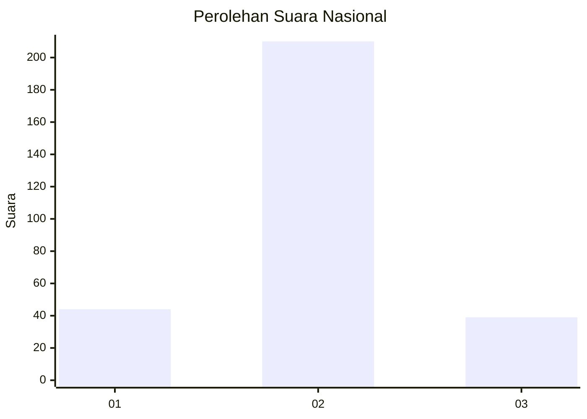
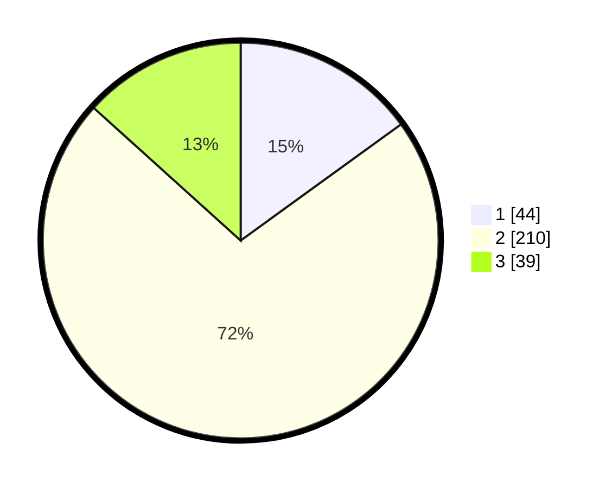

# Hasil

## Grafik

## Tabel

| No. | Nama Paslon    | Suara | Suara (raw) | Persentase |
|:--- |:-------------- | -----:| -----------:| ----------:|
| 1   | ANIES MUHAIMIN | 44    | [44][p-1]   | 15,02      |
| 2   | PRABOWO GIBRAN | 210   | [210][p-2]  | 71,67      |
| 3   | GANJAR MAHFUD  | 39    | [39][p-3]   | 13,31      |

[p-1]: https://github.com/gigit-pemilu/pemilu-2024/blob/main/pilpres/hitung-suara/sub/91-papua/sub/71-kota-jayapura/sub/03-abepura/sub/1014-vim/sub/013-tps/sub/paslon-1.txt
[p-2]: https://github.com/gigit-pemilu/pemilu-2024/blob/main/pilpres/hitung-suara/sub/91-papua/sub/71-kota-jayapura/sub/03-abepura/sub/1014-vim/sub/013-tps/sub/paslon-2.txt
[p-3]: https://github.com/gigit-pemilu/pemilu-2024/blob/main/pilpres/hitung-suara/sub/91-papua/sub/71-kota-jayapura/sub/03-abepura/sub/1014-vim/sub/013-tps/sub/paslon-3.txt

## Foto C Plano

https://sirekap-obj-formc.kpu.go.id/f40e/pemilu/ppwp/91/71/03/10/14/9171031014013-20240215-052329--c57ad9f6-3546-4d3e-94dd-8e89a6f2a1b7.jpg

https://sirekap-obj-formc.kpu.go.id/f40e/pemilu/ppwp/91/71/03/10/14/9171031014013-20240215-052709--f9fe37a7-88fe-4eda-83b6-5662be0b2036.jpg

https://sirekap-obj-formc.kpu.go.id/f40e/pemilu/ppwp/91/71/03/10/14/9171031014013-20240215-052927--ecbc2892-2ed9-484b-95d3-82e9c5beade2.jpg

## Metadata

| Key        | Value               |
| ---------- | ------------------- |
| Time Stamp | 2024-02-16 09:30:28 |

