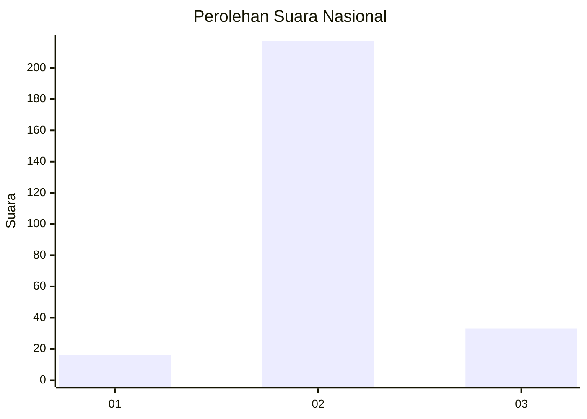
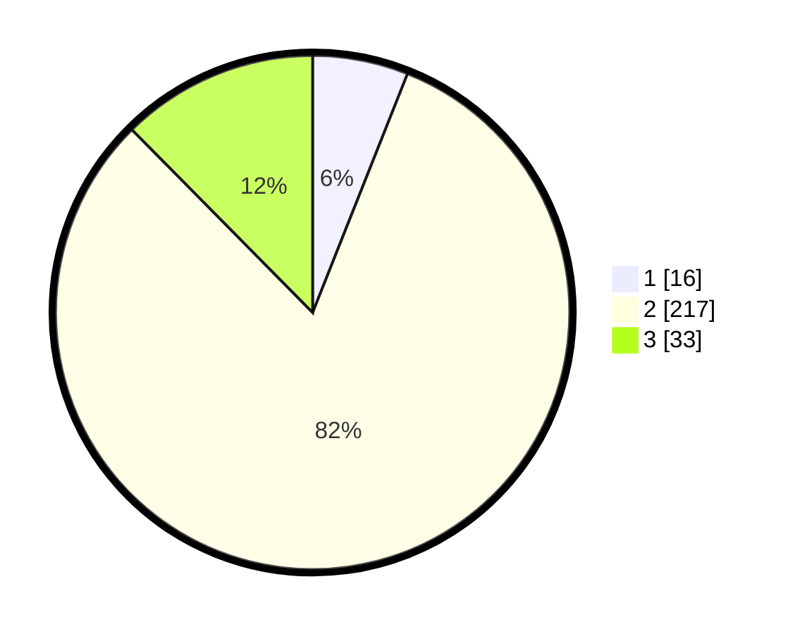

# Hasil

## Grafik

## Tabel

| No. | Nama Paslon    | Suara | Suara (raw) | Persentase |
|:--- |:-------------- | -----:| -----------:| ----------:|
| 1   | ANIES MUHAIMIN | 16    | [16][p-1]   | 6,02       |
| 2   | PRABOWO GIBRAN | 217   | [217][p-2]  | 81,58      |
| 3   | GANJAR MAHFUD  | 33    | [33][p-3]   | 12,41      |

[p-1]: https://github.com/gigit-pemilu/pemilu-2024/blob/main/pilpres/hitung-suara/sub/91-papua/sub/71-kota-jayapura/sub/03-abepura/sub/1014-vim/sub/021-tps/sub/paslon-1.txt
[p-2]: https://github.com/gigit-pemilu/pemilu-2024/blob/main/pilpres/hitung-suara/sub/91-papua/sub/71-kota-jayapura/sub/03-abepura/sub/1014-vim/sub/021-tps/sub/paslon-2.txt
[p-3]: https://github.com/gigit-pemilu/pemilu-2024/blob/main/pilpres/hitung-suara/sub/91-papua/sub/71-kota-jayapura/sub/03-abepura/sub/1014-vim/sub/021-tps/sub/paslon-3.txt

## Foto C Plano

https://sirekap-obj-formc.kpu.go.id/32e8/pemilu/ppwp/91/71/03/10/14/9171031014021-20240215-071520--9568990e-b5e8-4391-a8d3-fcd59fe1801e.jpg

https://sirekap-obj-formc.kpu.go.id/32e8/pemilu/ppwp/91/71/03/10/14/9171031014021-20240215-071523--93de3484-b5a2-4ec1-a323-5a70df8d336a.jpg

https://sirekap-obj-formc.kpu.go.id/32e8/pemilu/ppwp/91/71/03/10/14/9171031014021-20240215-071527--3bccd8d2-68f3-41a9-a292-38860b2a4fcc.jpg

## Metadata

| Key        | Value               |
| ---------- | ------------------- |
| Time Stamp | 2024-02-16 09:30:28 |

