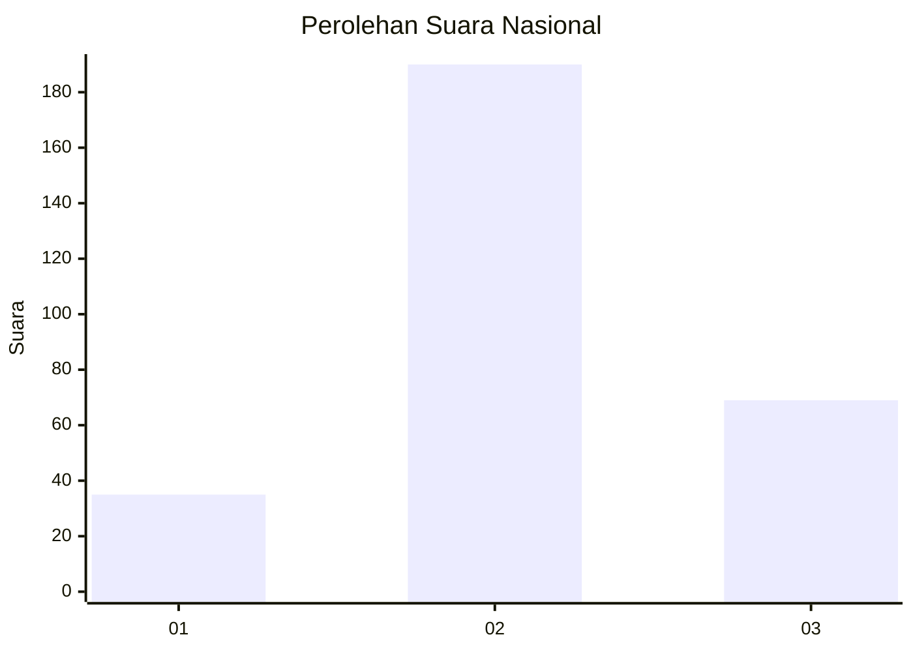
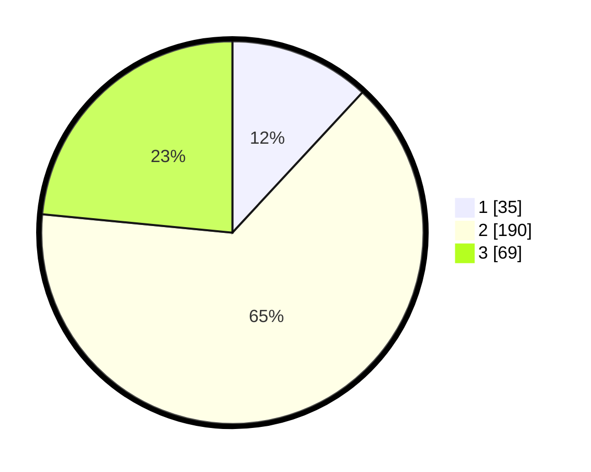

# Hasil

## Grafik

## Tabel

| No. | Nama Paslon    | Suara | Suara (raw) | Persentase |
|:--- |:-------------- | -----:| -----------:| ----------:|
| 1   | ANIES MUHAIMIN | 35    | [35][p-1]   | 11,90      |
| 2   | PRABOWO GIBRAN | 190   | [190][p-2]  | 64,63      |
| 3   | GANJAR MAHFUD  | 69    | [69][p-3]   | 23,47      |

[p-1]: https://github.com/gigit-pemilu/pemilu-2024/blob/main/pilpres/hitung-suara/sub/91-papua/sub/71-kota-jayapura/sub/03-abepura/sub/1014-vim/sub/023-tps/sub/paslon-1.txt
[p-2]: https://github.com/gigit-pemilu/pemilu-2024/blob/main/pilpres/hitung-suara/sub/91-papua/sub/71-kota-jayapura/sub/03-abepura/sub/1014-vim/sub/023-tps/sub/paslon-2.txt
[p-3]: https://github.com/gigit-pemilu/pemilu-2024/blob/main/pilpres/hitung-suara/sub/91-papua/sub/71-kota-jayapura/sub/03-abepura/sub/1014-vim/sub/023-tps/sub/paslon-3.txt

## Foto C Plano

https://sirekap-obj-formc.kpu.go.id/f11e/pemilu/ppwp/91/71/03/10/14/9171031014023-20240214-202838--113de5dd-5a38-418c-ae56-c83dddea6f9c.jpg

https://sirekap-obj-formc.kpu.go.id/f11e/pemilu/ppwp/91/71/03/10/14/9171031014023-20240214-202956--9688fbfb-f80c-472e-94dc-db7c128e6b7b.jpg

https://sirekap-obj-formc.kpu.go.id/f11e/pemilu/ppwp/91/71/03/10/14/9171031014023-20240214-203045--0334a32f-e7dd-4823-a269-3dfa16f48140.jpg

## Metadata

| Key        | Value               |
| ---------- | ------------------- |
| Time Stamp | 2024-02-19 06:16:00 |

## DATA PEMILIH TETAP

Jumlah pemilih dalam DPT: **291**.
 * L: **144**.
 * P: **147**.

## DATA PENGGUNA HAK PILIH

Jumlah pengguna hak pilih dalam DPT: **262**.
 * L: **126**.
 * P: **136**.

Jumlah pengguna hak pilih dalam DPTb: **4**.
 * L: **3**.
 * P: **1**.

Jumlah pengguna hak pilih dalam DPK: **21**.
 * L: **14**.
 * P: **7**.

Jumlah pengguna hak pilih: **287**.
 * L: **143**.
 * P: **144**.

## JUMLAH SUARA SAH DAN TIDAK SAH

JUMLAH SELURUH SUARA SAH: **294**.

JUMLAH SUARA TIDAK SAH: **3**.

JUMLAH SELURUH SUARA SAH DAN SUARA TIDAK SAH: **297**.

