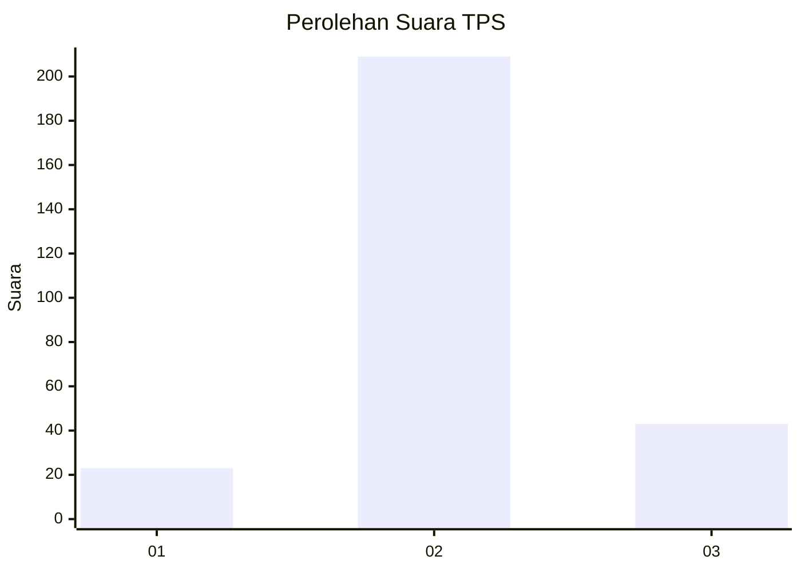
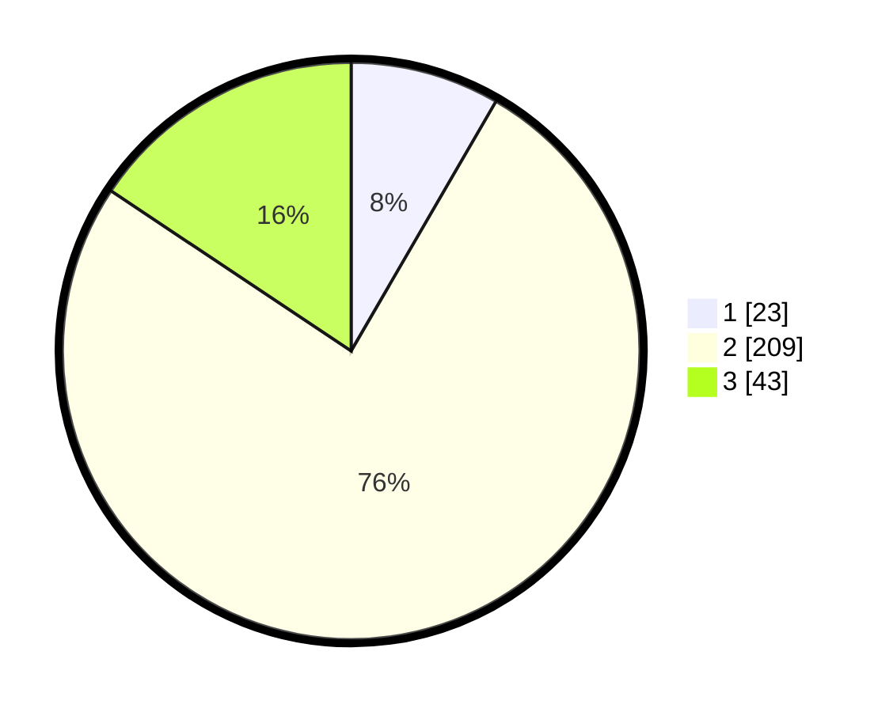

# Hasil

## Grafik

## Tabel

| No. | Nama Paslon    | Suara | Suara (raw) | Persentase |
|:--- |:-------------- | -----:| -----------:| ----------:|
| 1   | ANIES MUHAIMIN | 23    | [23][p-1]   | 8,36       |
| 2   | PRABOWO GIBRAN | 209   | [209][p-2]  | 76,00      |
| 3   | GANJAR MAHFUD  | 43    | [43][p-3]   | 15,64      |

[p-1]: https://github.com/gigit-pemilu/pemilu-2024-91-papua/blob/main/pilpres/hitung-suara/sub/91-papua/sub/71-kota-jayapura/sub/03-abepura/sub/1014-vim/sub/028-tps/sub/paslon-1.txt
[p-2]: https://github.com/gigit-pemilu/pemilu-2024-91-papua/blob/main/pilpres/hitung-suara/sub/91-papua/sub/71-kota-jayapura/sub/03-abepura/sub/1014-vim/sub/028-tps/sub/paslon-2.txt
[p-3]: https://github.com/gigit-pemilu/pemilu-2024-91-papua/blob/main/pilpres/hitung-suara/sub/91-papua/sub/71-kota-jayapura/sub/03-abepura/sub/1014-vim/sub/028-tps/sub/paslon-3.txt

## Foto C Plano

https://sirekap-obj-formc.kpu.go.id/489e/pemilu/ppwp/91/71/03/10/14/9171031014028-20240215-163728--c02efd24-5c50-47e0-a1ef-62961bb6b466.jpg

https://sirekap-obj-formc.kpu.go.id/489e/pemilu/ppwp/91/71/03/10/14/9171031014028-20240215-163918--03f33dbb-3070-4110-b114-f8f5807dea7d.jpg

https://sirekap-obj-formc.kpu.go.id/489e/pemilu/ppwp/91/71/03/10/14/9171031014028-20240215-164401--9b38a4e9-9c78-470d-97f1-3d5c59d8a01a.jpg

## Metadata

| Key        | Value               |
| ---------- | ------------------- |
| Time Stamp | 2024-02-25 00:00:00 |

