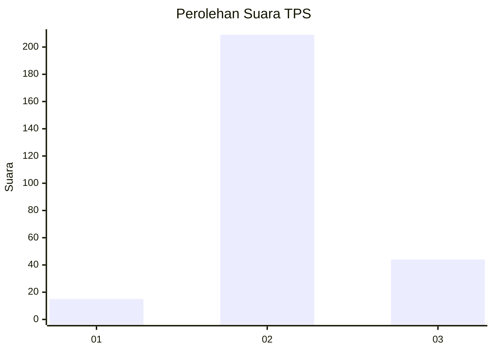
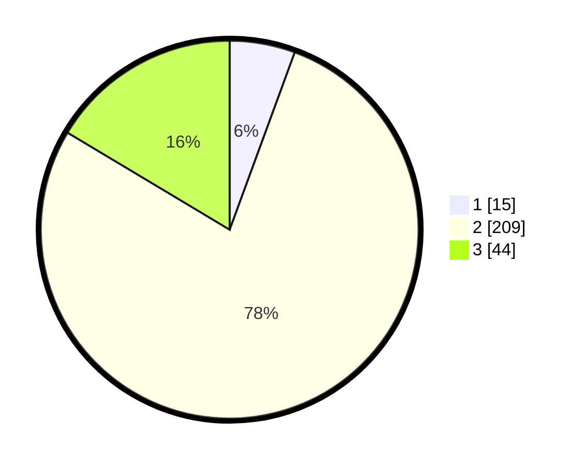

# Hasil

## Grafik

## Tabel

| No. | Nama Paslon    | Suara | Suara (raw) | Persentase |
|:--- |:-------------- | -----:| -----------:| ----------:|
| 1   | ANIES MUHAIMIN | 15    | [15][p-1]   | 5,60       |
| 2   | PRABOWO GIBRAN | 209   | [209][p-2]  | 77,99      |
| 3   | GANJAR MAHFUD  | 44    | [44][p-3]   | 16,42      |

[p-1]: https://github.com/gigit-pemilu/pemilu-2024-91-papua/blob/main/pilpres/hitung-suara/sub/91-papua/sub/71-kota-jayapura/sub/03-abepura/sub/1014-vim/sub/029-tps/sub/paslon-1.txt
[p-2]: https://github.com/gigit-pemilu/pemilu-2024-91-papua/blob/main/pilpres/hitung-suara/sub/91-papua/sub/71-kota-jayapura/sub/03-abepura/sub/1014-vim/sub/029-tps/sub/paslon-2.txt
[p-3]: https://github.com/gigit-pemilu/pemilu-2024-91-papua/blob/main/pilpres/hitung-suara/sub/91-papua/sub/71-kota-jayapura/sub/03-abepura/sub/1014-vim/sub/029-tps/sub/paslon-3.txt

## Foto C Plano

https://sirekap-obj-formc.kpu.go.id/dc31/pemilu/ppwp/91/71/03/10/14/9171031014029-20240215-143623--03dbf247-5ff4-471e-9362-145625e55675.jpg

https://sirekap-obj-formc.kpu.go.id/dc31/pemilu/ppwp/91/71/03/10/14/9171031014029-20240215-071454--0b6e87ed-4436-4525-8338-2010710c84f3.jpg

https://sirekap-obj-formc.kpu.go.id/dc31/pemilu/ppwp/91/71/03/10/14/9171031014029-20240215-071809--ce96f0b1-9b67-40ad-91ab-7c6367a7c8d5.jpg

## Metadata

| Key        | Value               |
| ---------- | ------------------- |
| Time Stamp | 2024-02-16 09:30:28 |

