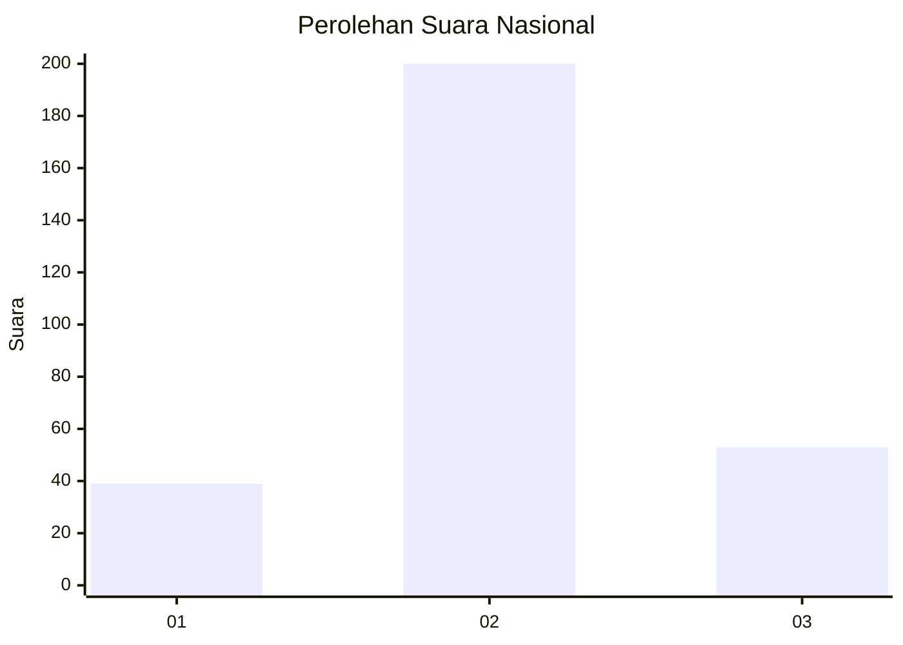
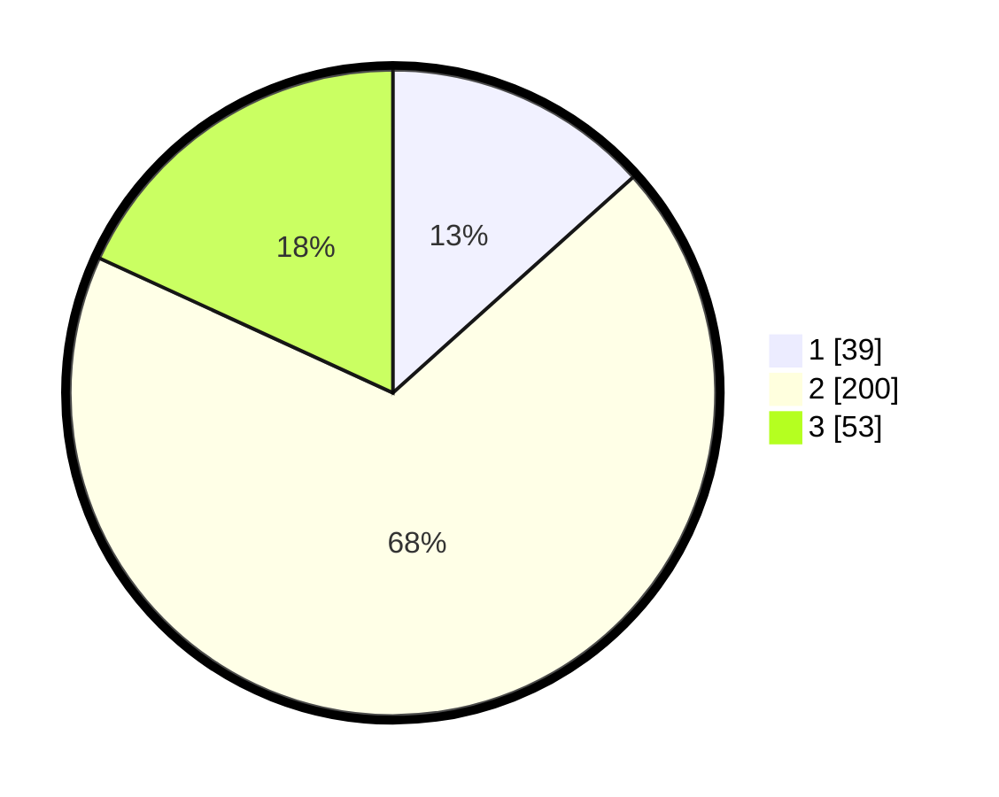

# Hasil

## Grafik

## Tabel

| No. | Nama Paslon    | Suara | Suara (raw) | Persentase |
|:--- |:-------------- | -----:| -----------:| ----------:|
| 1   | ANIES MUHAIMIN | 39    | [39][p-1]   | 13,36      |
| 2   | PRABOWO GIBRAN | 200   | [200][p-2]  | 68,49      |
| 3   | GANJAR MAHFUD  | 53    | [53][p-3]   | 18,15      |

[p-1]: https://github.com/gigit-pemilu/pemilu-2024/blob/main/pilpres/hitung-suara/sub/91-papua/sub/71-kota-jayapura/sub/03-abepura/sub/1014-vim/sub/031-tps/sub/paslon-1.txt
[p-2]: https://github.com/gigit-pemilu/pemilu-2024/blob/main/pilpres/hitung-suara/sub/91-papua/sub/71-kota-jayapura/sub/03-abepura/sub/1014-vim/sub/031-tps/sub/paslon-2.txt
[p-3]: https://github.com/gigit-pemilu/pemilu-2024/blob/main/pilpres/hitung-suara/sub/91-papua/sub/71-kota-jayapura/sub/03-abepura/sub/1014-vim/sub/031-tps/sub/paslon-3.txt

## Foto C Plano

https://sirekap-obj-formc.kpu.go.id/d0f2/pemilu/ppwp/91/71/03/10/14/9171031014031-20240215-030139--51185828-1768-4cd5-ab5a-07248b491de3.jpg

https://sirekap-obj-formc.kpu.go.id/d0f2/pemilu/ppwp/91/71/03/10/14/9171031014031-20240215-030537--de965718-4814-4a41-b77c-fc3963ca8b1e.jpg

https://sirekap-obj-formc.kpu.go.id/d0f2/pemilu/ppwp/91/71/03/10/14/9171031014031-20240215-031126--16e161f4-828b-4257-a75a-40b01bac0654.jpg

## Metadata

| Key        | Value               |
| ---------- | ------------------- |
| Time Stamp | 2024-02-16 09:30:28 |

