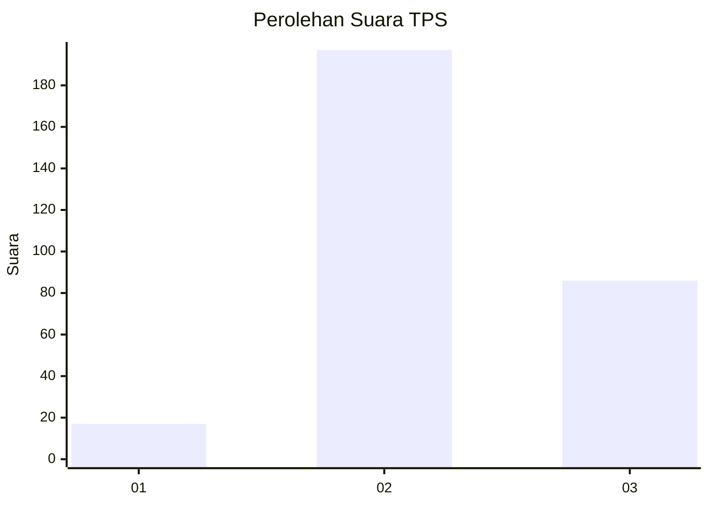
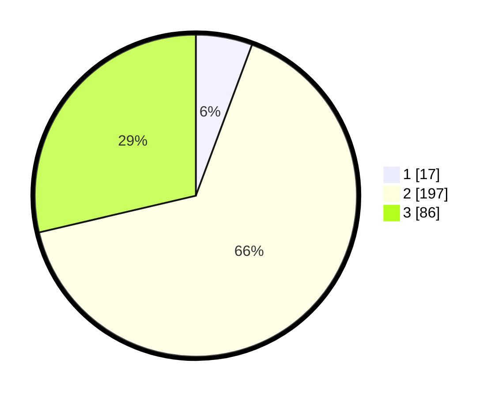

# Hasil

## Grafik

## Tabel

| No. | Nama Paslon    | Suara | Suara (raw) | Persentase |
|:--- |:-------------- | -----:| -----------:| ----------:|
| 1   | ANIES MUHAIMIN | 17    | [17][p-1]   | 5,67       |
| 2   | PRABOWO GIBRAN | 197   | [197][p-2]  | 65,67      |
| 3   | GANJAR MAHFUD  | 86    | [86][p-3]   | 28,67      |

[p-1]: https://github.com/gigit-pemilu/pemilu-2024-91-papua/blob/main/pilpres/hitung-suara/sub/91-papua/sub/71-kota-jayapura/sub/03-abepura/sub/1014-vim/sub/042-tps/sub/paslon-1.txt
[p-2]: https://github.com/gigit-pemilu/pemilu-2024-91-papua/blob/main/pilpres/hitung-suara/sub/91-papua/sub/71-kota-jayapura/sub/03-abepura/sub/1014-vim/sub/042-tps/sub/paslon-2.txt
[p-3]: https://github.com/gigit-pemilu/pemilu-2024-91-papua/blob/main/pilpres/hitung-suara/sub/91-papua/sub/71-kota-jayapura/sub/03-abepura/sub/1014-vim/sub/042-tps/sub/paslon-3.txt

## Foto C Plano

https://sirekap-obj-formc.kpu.go.id/9449/pemilu/ppwp/91/71/03/10/14/9171031014042-20240215-024835--4edbb0e6-2077-49ce-b9a5-5dc211ed48bc.jpg

https://sirekap-obj-formc.kpu.go.id/9449/pemilu/ppwp/91/71/03/10/14/9171031014042-20240215-025014--0f74d23e-8ebd-42fa-bf1b-8b77600dbe83.jpg

https://sirekap-obj-formc.kpu.go.id/9449/pemilu/ppwp/91/71/03/10/14/9171031014042-20240215-025115--0365a2f9-9745-42b1-ba8d-17babd453f10.jpg

## Metadata

| Key        | Value               |
| ---------- | ------------------- |
| Time Stamp | 2024-02-16 10:00:28 |

