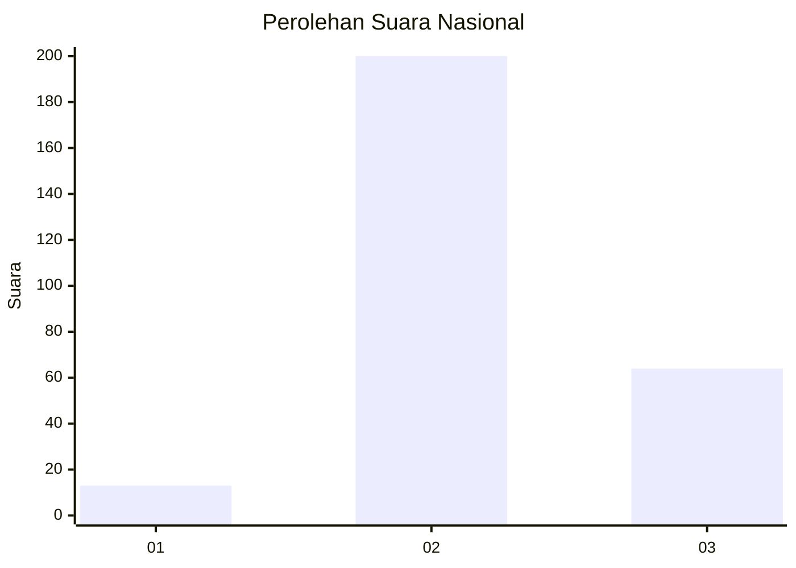
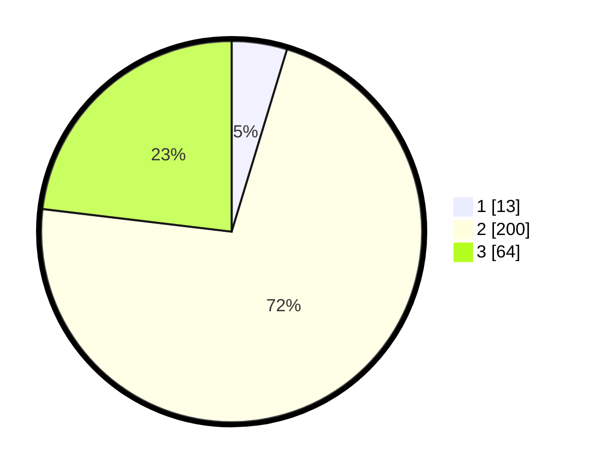

# Hasil

## Grafik

## Tabel

| No. | Nama Paslon    | Suara | Suara (raw) | Persentase |
|:--- |:-------------- | -----:| -----------:| ----------:|
| 1   | ANIES MUHAIMIN | 13    | [13][p-1]   | 4,69       |
| 2   | PRABOWO GIBRAN | 200   | [200][p-2]  | 72,20      |
| 3   | GANJAR MAHFUD  | 64    | [64][p-3]   | 23,10      |

[p-1]: https://github.com/gigit-pemilu/pemilu-2024/blob/main/pilpres/hitung-suara/sub/91-papua/sub/71-kota-jayapura/sub/03-abepura/sub/1014-vim/sub/043-tps/sub/paslon-1.txt
[p-2]: https://github.com/gigit-pemilu/pemilu-2024/blob/main/pilpres/hitung-suara/sub/91-papua/sub/71-kota-jayapura/sub/03-abepura/sub/1014-vim/sub/043-tps/sub/paslon-2.txt
[p-3]: https://github.com/gigit-pemilu/pemilu-2024/blob/main/pilpres/hitung-suara/sub/91-papua/sub/71-kota-jayapura/sub/03-abepura/sub/1014-vim/sub/043-tps/sub/paslon-3.txt

## Foto C Plano

https://sirekap-obj-formc.kpu.go.id/311b/pemilu/ppwp/91/71/03/10/14/9171031014043-20240215-074506--0cddd4b8-abcf-48b5-8706-f4ae51f15f3d.jpg

https://sirekap-obj-formc.kpu.go.id/311b/pemilu/ppwp/91/71/03/10/14/9171031014043-20240215-074627--4cfeee0d-3a93-41d4-9b1e-aa7a336611ee.jpg

https://sirekap-obj-formc.kpu.go.id/311b/pemilu/ppwp/91/71/03/10/14/9171031014043-20240215-074755--164afc25-4fe6-489b-9faa-246ff9de6b32.jpg

## Metadata

| Key        | Value               |
| ---------- | ------------------- |
| Time Stamp | 2024-02-16 05:30:26 |

