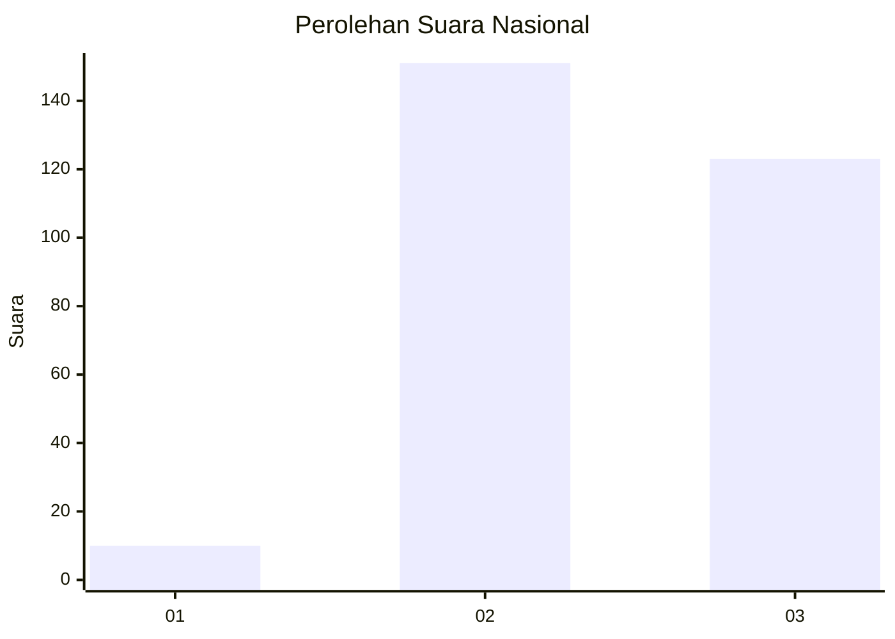
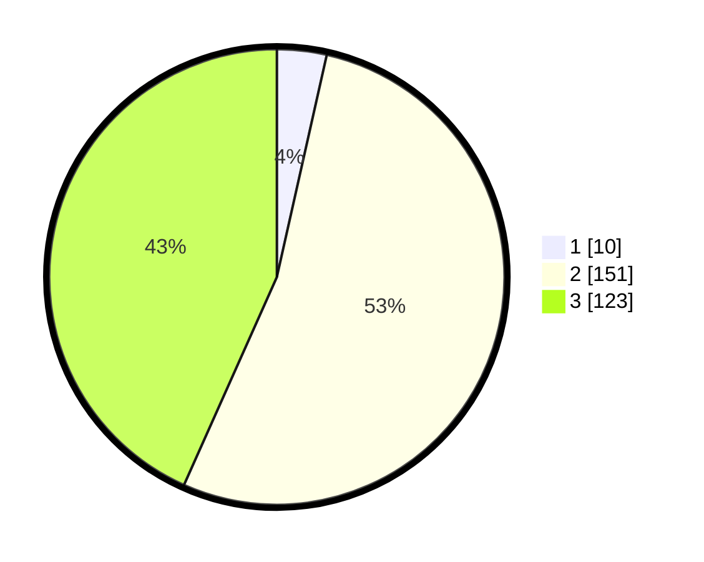

# Hasil

## Grafik

## Tabel

| No. | Nama Paslon    | Suara | Suara (raw) | Persentase |
|:--- |:-------------- | -----:| -----------:| ----------:|
| 1   | ANIES MUHAIMIN | 10    | [10][p-1]   | 3,52       |
| 2   | PRABOWO GIBRAN | 151   | [151][p-2]  | 53,17      |
| 3   | GANJAR MAHFUD  | 123   | [123][p-3]  | 43,31      |

[p-1]: https://github.com/gigit-pemilu/pemilu-2024/blob/main/pilpres/hitung-suara/sub/91-papua/sub/71-kota-jayapura/sub/03-abepura/sub/1014-vim/sub/044-tps/sub/paslon-1.txt
[p-2]: https://github.com/gigit-pemilu/pemilu-2024/blob/main/pilpres/hitung-suara/sub/91-papua/sub/71-kota-jayapura/sub/03-abepura/sub/1014-vim/sub/044-tps/sub/paslon-2.txt
[p-3]: https://github.com/gigit-pemilu/pemilu-2024/blob/main/pilpres/hitung-suara/sub/91-papua/sub/71-kota-jayapura/sub/03-abepura/sub/1014-vim/sub/044-tps/sub/paslon-3.txt

## Foto C Plano

https://sirekap-obj-formc.kpu.go.id/2e7d/pemilu/ppwp/91/71/03/10/14/9171031014044-20240214-202434--5b9520d2-4785-473f-8940-180a4534c07b.jpg

https://sirekap-obj-formc.kpu.go.id/2e7d/pemilu/ppwp/91/71/03/10/14/9171031014044-20240214-202039--b635c35d-bad1-44e6-9ce0-65b54b52e050.jpg

https://sirekap-obj-formc.kpu.go.id/2e7d/pemilu/ppwp/91/71/03/10/14/9171031014044-20240214-202155--7229ec53-e23e-411a-9109-ea5c6cad4bd4.jpg

## Metadata

| Key        | Value               |
| ---------- | ------------------- |
| Time Stamp | 2024-02-16 10:00:28 |

