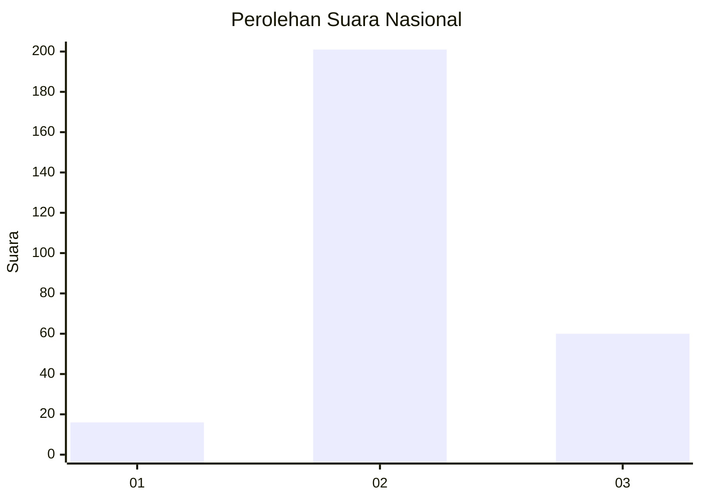

# Hasil

## Grafik

## Tabel

| No. | Nama Paslon    | Suara | Suara (raw) | Persentase |
|:--- |:-------------- | -----:| -----------:| ----------:|
| 1   | ANIES MUHAIMIN | 16    | [16][p-1]   | 5,78       |
| 2   | PRABOWO GIBRAN | 201   | [201][p-2]  | 72,56      |
| 3   | GANJAR MAHFUD  | 60    | [60][p-3]   | 21,66      |

[p-1]: https://github.com/gigit-pemilu/pemilu-2024/blob/main/pilpres/hitung-suara/sub/91-papua/sub/71-kota-jayapura/sub/03-abepura/sub/1014-vim/sub/045-tps/sub/paslon-1.txt
[p-2]: https://github.com/gigit-pemilu/pemilu-2024/blob/main/pilpres/hitung-suara/sub/91-papua/sub/71-kota-jayapura/sub/03-abepura/sub/1014-vim/sub/045-tps/sub/paslon-2.txt
[p-3]: https://github.com/gigit-pemilu/pemilu-2024/blob/main/pilpres/hitung-suara/sub/91-papua/sub/71-kota-jayapura/sub/03-abepura/sub/1014-vim/sub/045-tps/sub/paslon-3.txt

## Foto C Plano

https://sirekap-obj-formc.kpu.go.id/b9cb/pemilu/ppwp/91/71/03/10/14/9171031014045-20240215-123540--7ea54bb2-5574-4fbe-bd7f-461fce4908f9.jpg

https://sirekap-obj-formc.kpu.go.id/b9cb/pemilu/ppwp/91/71/03/10/14/9171031014045-20240215-084122--11d86339-588c-48de-a9db-73aba928e51a.jpg

https://sirekap-obj-formc.kpu.go.id/b9cb/pemilu/ppwp/91/71/03/10/14/9171031014045-20240215-084239--28e2b4fc-2f10-48b6-b150-0eb4805301c8.jpg

## Metadata

| Key        | Value               |
| ---------- | ------------------- |
| Time Stamp | 2024-02-16 10:00:28 |

