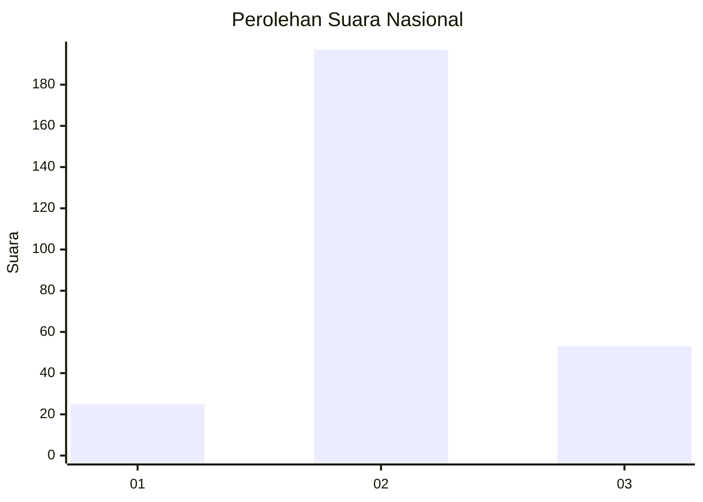
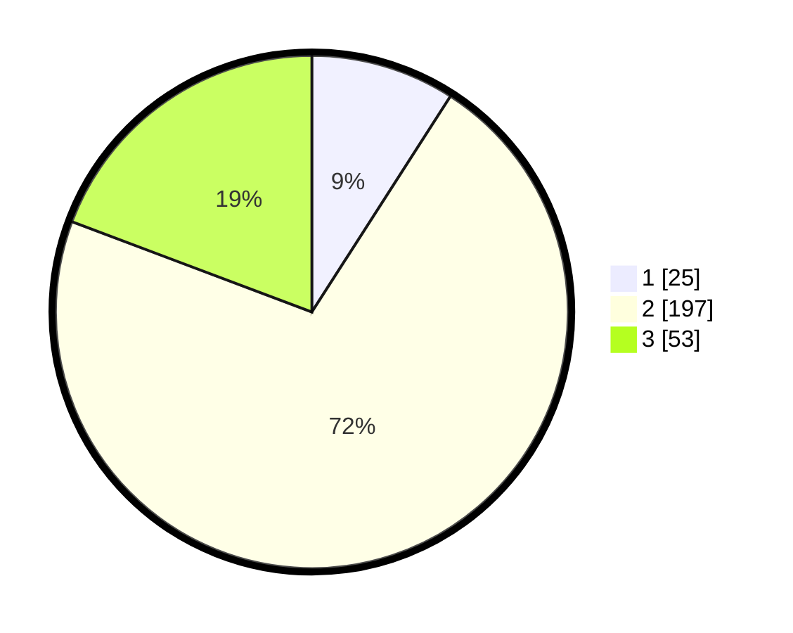

# Hasil

## Grafik

## Tabel

| No. | Nama Paslon    | Suara | Suara (raw) | Persentase |
|:--- |:-------------- | -----:| -----------:| ----------:|
| 1   | ANIES MUHAIMIN | 25    | [25][p-1]   | 9,09       |
| 2   | PRABOWO GIBRAN | 197   | [197][p-2]  | 71,64      |
| 3   | GANJAR MAHFUD  | 53    | [53][p-3]   | 19,27      |

[p-1]: https://github.com/gigit-pemilu/pemilu-2024/blob/main/pilpres/hitung-suara/sub/91-papua/sub/71-kota-jayapura/sub/03-abepura/sub/1014-vim/sub/047-tps/sub/paslon-1.txt
[p-2]: https://github.com/gigit-pemilu/pemilu-2024/blob/main/pilpres/hitung-suara/sub/91-papua/sub/71-kota-jayapura/sub/03-abepura/sub/1014-vim/sub/047-tps/sub/paslon-2.txt
[p-3]: https://github.com/gigit-pemilu/pemilu-2024/blob/main/pilpres/hitung-suara/sub/91-papua/sub/71-kota-jayapura/sub/03-abepura/sub/1014-vim/sub/047-tps/sub/paslon-3.txt

## Foto C Plano

https://sirekap-obj-formc.kpu.go.id/b308/pemilu/ppwp/91/71/03/10/14/9171031014047-20240215-074812--5c68844a-9fce-4c0a-bab0-73e557e348ff.jpg

https://sirekap-obj-formc.kpu.go.id/b308/pemilu/ppwp/91/71/03/10/14/9171031014047-20240215-074943--ee3e2a1c-5499-442c-bd2d-ff71cffc9360.jpg

https://sirekap-obj-formc.kpu.go.id/b308/pemilu/ppwp/91/71/03/10/14/9171031014047-20240215-075056--d90a7e55-f81b-4f44-b185-a53fe3839c02.jpg

## Metadata

| Key        | Value               |
| ---------- | ------------------- |
| Time Stamp | 2024-02-16 10:00:28 |

