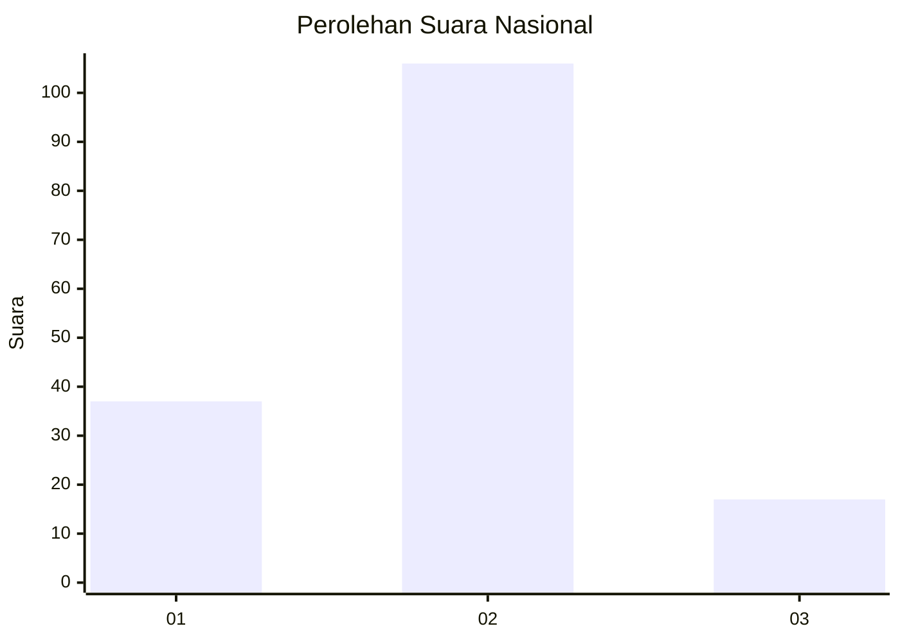
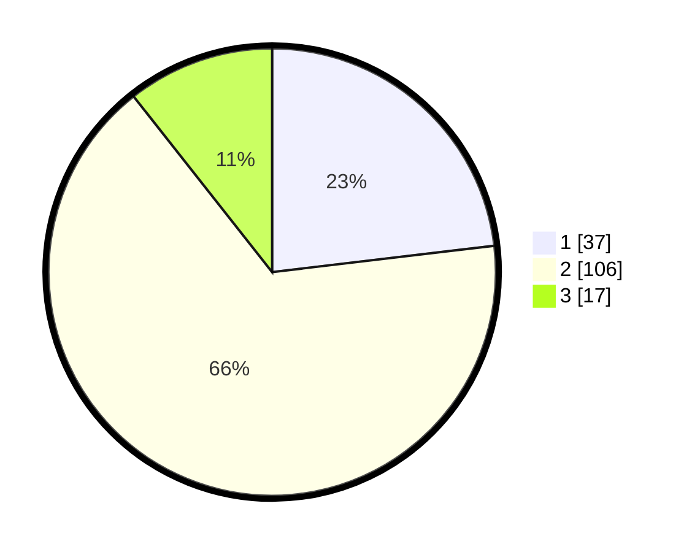

# Hasil

## Grafik

## Tabel

| No. | Nama Paslon    | Suara | Suara (raw) | Persentase |
|:--- |:-------------- | -----:| -----------:| ----------:|
| 1   | ANIES MUHAIMIN | 37    | [37][p-1]   | 23,13      |
| 2   | PRABOWO GIBRAN | 106   | [106][p-2]  | 66,25      |
| 3   | GANJAR MAHFUD  | 17    | [17][p-3]   | 10,63      |

[p-1]: https://github.com/gigit-pemilu/pemilu-2024/blob/main/pilpres/hitung-suara/sub/91-papua/sub/71-kota-jayapura/sub/03-abepura/sub/1015-wahno/sub/014-tps/sub/paslon-1.txt
[p-2]: https://github.com/gigit-pemilu/pemilu-2024/blob/main/pilpres/hitung-suara/sub/91-papua/sub/71-kota-jayapura/sub/03-abepura/sub/1015-wahno/sub/014-tps/sub/paslon-2.txt
[p-3]: https://github.com/gigit-pemilu/pemilu-2024/blob/main/pilpres/hitung-suara/sub/91-papua/sub/71-kota-jayapura/sub/03-abepura/sub/1015-wahno/sub/014-tps/sub/paslon-3.txt

## Foto C Plano

https://sirekap-obj-formc.kpu.go.id/c3a1/pemilu/ppwp/91/71/03/10/15/9171031015014-20240215-040135--8d6a2d42-a7c5-4fb3-93c4-d3efb7767027.jpg

https://sirekap-obj-formc.kpu.go.id/c3a1/pemilu/ppwp/91/71/03/10/15/9171031015014-20240215-040358--a57530b4-2237-43cd-b1e3-a033e1f6c953.jpg

https://sirekap-obj-formc.kpu.go.id/c3a1/pemilu/ppwp/91/71/03/10/15/9171031015014-20240215-040450--11627b05-4d94-4f64-aad4-9cbf8d4f53c6.jpg

## Metadata

| Key        | Value               |
| ---------- | ------------------- |
| Time Stamp | 2024-02-16 10:00:28 |

