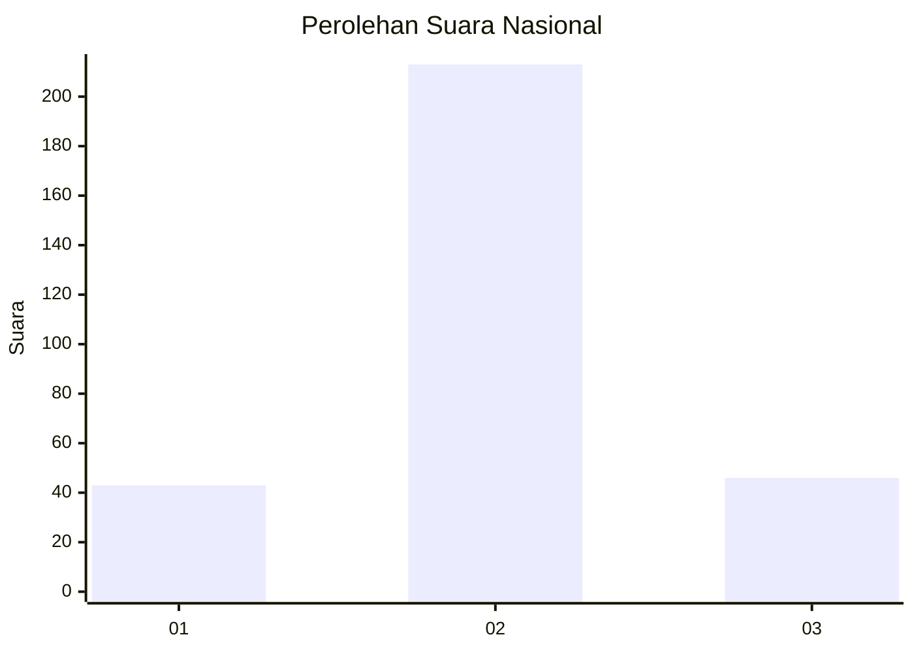

# Hasil

## Grafik

## Tabel

| No. | Nama Paslon    | Suara | Suara (raw) | Persentase |
|:--- |:-------------- | -----:| -----------:| ----------:|
| 1   | ANIES MUHAIMIN | 43    | [43][p-1]   | 14,24      |
| 2   | PRABOWO GIBRAN | 213   | [213][p-2]  | 70,53      |
| 3   | GANJAR MAHFUD  | 46    | [46][p-3]   | 15,23      |

[p-1]: https://github.com/gigit-pemilu/pemilu-2024/blob/main/pilpres/hitung-suara/sub/91-papua/sub/71-kota-jayapura/sub/03-abepura/sub/1015-wahno/sub/015-tps/sub/paslon-1.txt
[p-2]: https://github.com/gigit-pemilu/pemilu-2024/blob/main/pilpres/hitung-suara/sub/91-papua/sub/71-kota-jayapura/sub/03-abepura/sub/1015-wahno/sub/015-tps/sub/paslon-2.txt
[p-3]: https://github.com/gigit-pemilu/pemilu-2024/blob/main/pilpres/hitung-suara/sub/91-papua/sub/71-kota-jayapura/sub/03-abepura/sub/1015-wahno/sub/015-tps/sub/paslon-3.txt

## Foto C Plano

https://sirekap-obj-formc.kpu.go.id/5b27/pemilu/ppwp/91/71/03/10/15/9171031015015-20240214-205006--3f219b47-7253-46e9-86d6-c5d342a42d74.jpg

https://sirekap-obj-formc.kpu.go.id/5b27/pemilu/ppwp/91/71/03/10/15/9171031015015-20240214-203926--fba265e8-4f52-4f31-86cf-761f02b05f4b.jpg

https://sirekap-obj-formc.kpu.go.id/5b27/pemilu/ppwp/91/71/03/10/15/9171031015015-20240214-204141--9ed2c410-3f95-451e-bb4e-47748d11a3fd.jpg

## Metadata

| Key        | Value               |
| ---------- | ------------------- |
| Time Stamp | 2024-02-16 10:00:28 |

