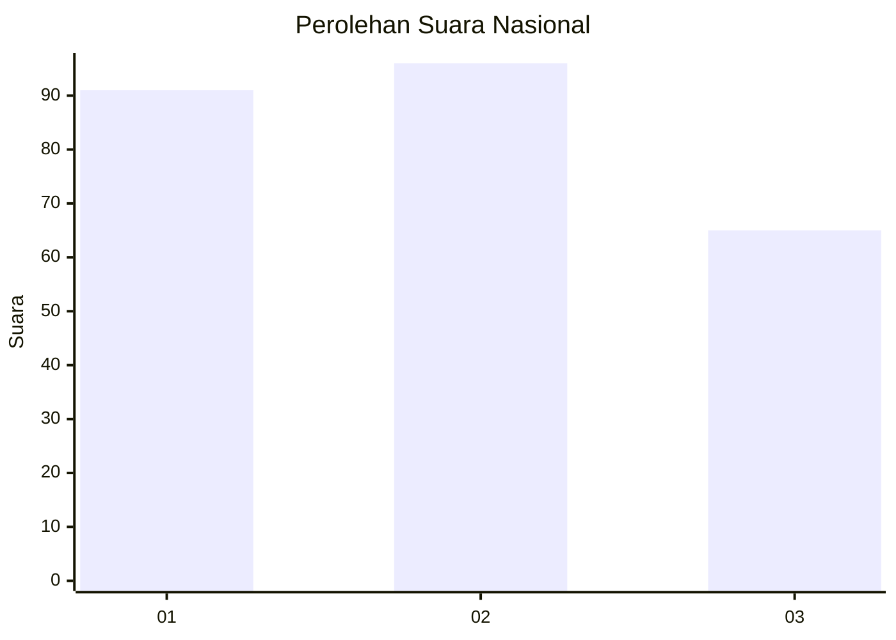
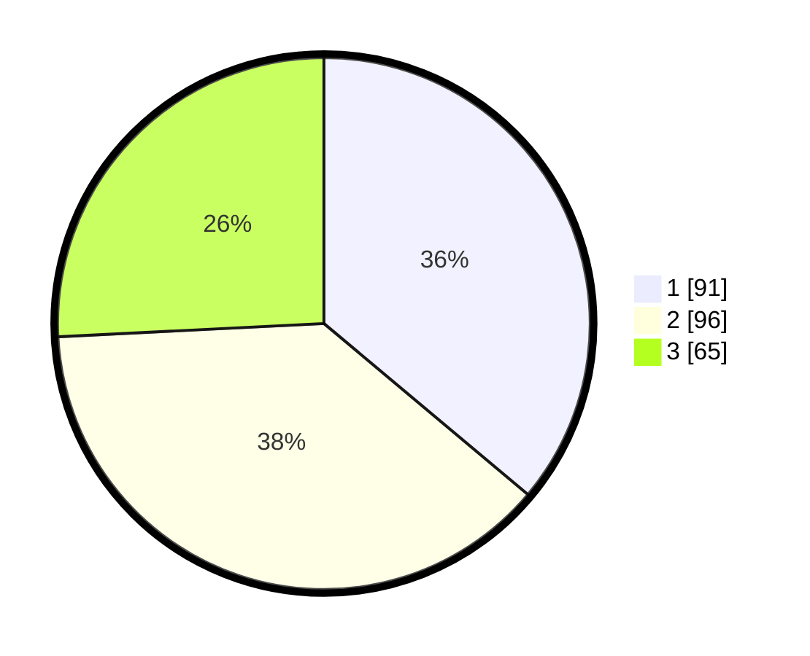

# Hasil

## Grafik

## Tabel

| No. | Nama Paslon    | Suara | Suara (raw) | Persentase |
|:--- |:-------------- | -----:| -----------:| ----------:|
| 1   | ANIES MUHAIMIN | 91    | [91][p-1]   | 36,11      |
| 2   | PRABOWO GIBRAN | 96    | [96][p-2]   | 38,10      |
| 3   | GANJAR MAHFUD  | 65    | [65][p-3]   | 25,79      |

[p-1]: https://github.com/gigit-pemilu/pemilu-2024/blob/main/pilpres/hitung-suara/sub/91-papua/sub/71-kota-jayapura/sub/03-abepura/sub/1016-way-mhorock/sub/010-tps/sub/paslon-1.txt
[p-2]: https://github.com/gigit-pemilu/pemilu-2024/blob/main/pilpres/hitung-suara/sub/91-papua/sub/71-kota-jayapura/sub/03-abepura/sub/1016-way-mhorock/sub/010-tps/sub/paslon-2.txt
[p-3]: https://github.com/gigit-pemilu/pemilu-2024/blob/main/pilpres/hitung-suara/sub/91-papua/sub/71-kota-jayapura/sub/03-abepura/sub/1016-way-mhorock/sub/010-tps/sub/paslon-3.txt

## Foto C Plano

https://sirekap-obj-formc.kpu.go.id/b59f/pemilu/ppwp/91/71/03/10/16/9171031016010-20240215-055859--8866c391-a44d-4108-a9cb-0da1dd12b6a6.jpg

https://sirekap-obj-formc.kpu.go.id/b59f/pemilu/ppwp/91/71/03/10/16/9171031016010-20240215-062019--5fb0f24e-b88f-4b4c-a5bc-6be9127f4cb3.jpg

https://sirekap-obj-formc.kpu.go.id/b59f/pemilu/ppwp/91/71/03/10/16/9171031016010-20240215-055723--471f4087-4516-44e0-b61e-ad48428eb520.jpg

## Metadata

| Key        | Value               |
| ---------- | ------------------- |
| Time Stamp | 2024-02-24 22:31:28 |

