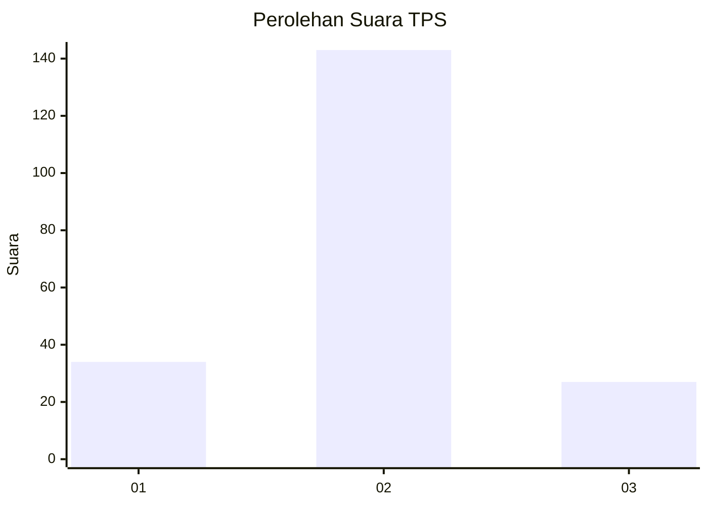
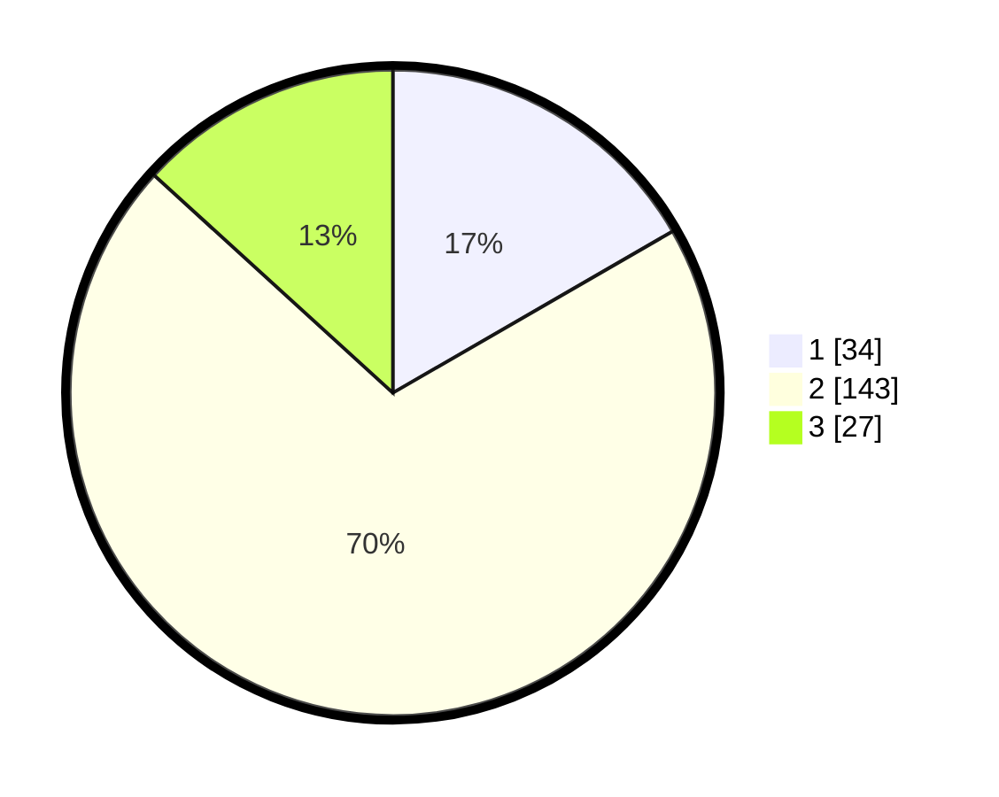

# Hasil

## Grafik

## Tabel

| No. | Nama Paslon    | Suara | Suara (raw) | Persentase |
|:--- |:-------------- | -----:| -----------:| ----------:|
| 1   | ANIES MUHAIMIN | 34    | [34][p-1]   | 16,67      |
| 2   | PRABOWO GIBRAN | 143   | [143][p-2]  | 70,10      |
| 3   | GANJAR MAHFUD  | 27    | [27][p-3]   | 13,24      |

[p-1]: https://github.com/gigit-pemilu/pemilu-2024-91-papua/blob/main/pilpres/hitung-suara/sub/91-papua/sub/71-kota-jayapura/sub/03-abepura/sub/1016-way-mhorock/sub/012-tps/sub/paslon-1.txt
[p-2]: https://github.com/gigit-pemilu/pemilu-2024-91-papua/blob/main/pilpres/hitung-suara/sub/91-papua/sub/71-kota-jayapura/sub/03-abepura/sub/1016-way-mhorock/sub/012-tps/sub/paslon-2.txt
[p-3]: https://github.com/gigit-pemilu/pemilu-2024-91-papua/blob/main/pilpres/hitung-suara/sub/91-papua/sub/71-kota-jayapura/sub/03-abepura/sub/1016-way-mhorock/sub/012-tps/sub/paslon-3.txt

## Foto C Plano

https://sirekap-obj-formc.kpu.go.id/91d3/pemilu/ppwp/91/71/03/10/16/9171031016012-20240215-014909--89fb4d8d-a545-4bf8-b3bf-8c3d237fedf2.jpg

https://sirekap-obj-formc.kpu.go.id/91d3/pemilu/ppwp/91/71/03/10/16/9171031016012-20240215-015322--7692dc82-12c7-40c6-937c-b48d7d9b1252.jpg

https://sirekap-obj-formc.kpu.go.id/91d3/pemilu/ppwp/91/71/03/10/16/9171031016012-20240215-015512--c4df8d6b-c938-477c-b917-6c475870c581.jpg

## Metadata

| Key        | Value               |
| ---------- | ------------------- |
| Time Stamp | 2024-02-16 10:00:28 |

