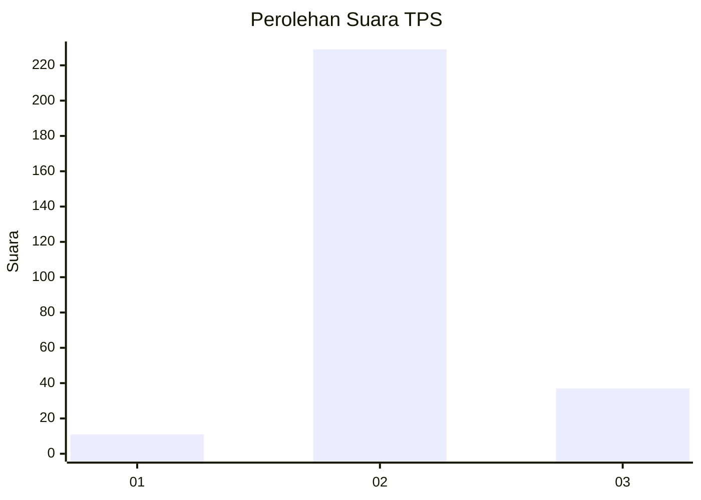
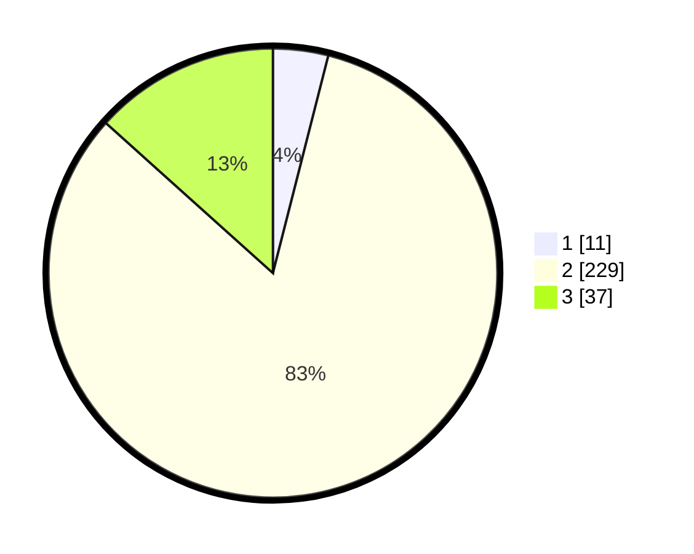

# Hasil

## Grafik

## Tabel

| No. | Nama Paslon    | Suara | Suara (raw) | Persentase |
|:--- |:-------------- | -----:| -----------:| ----------:|
| 1   | ANIES MUHAIMIN | 11    | [11][p-1]   | 3,97       |
| 2   | PRABOWO GIBRAN | 229   | [229][p-2]  | 82,67      |
| 3   | GANJAR MAHFUD  | 37    | [37][p-3]   | 13,36      |

[p-1]: https://github.com/gigit-pemilu/pemilu-2024-91-papua/blob/main/pilpres/hitung-suara/sub/91-papua/sub/71-kota-jayapura/sub/03-abepura/sub/1016-way-mhorock/sub/014-tps/sub/paslon-1.txt
[p-2]: https://github.com/gigit-pemilu/pemilu-2024-91-papua/blob/main/pilpres/hitung-suara/sub/91-papua/sub/71-kota-jayapura/sub/03-abepura/sub/1016-way-mhorock/sub/014-tps/sub/paslon-2.txt
[p-3]: https://github.com/gigit-pemilu/pemilu-2024-91-papua/blob/main/pilpres/hitung-suara/sub/91-papua/sub/71-kota-jayapura/sub/03-abepura/sub/1016-way-mhorock/sub/014-tps/sub/paslon-3.txt

## Foto C Plano

https://sirekap-obj-formc.kpu.go.id/7356/pemilu/ppwp/91/71/03/10/16/9171031016014-20240214-192254--6a9475f0-ef32-4ee2-b037-d3f35ea7b5b5.jpg

https://sirekap-obj-formc.kpu.go.id/7356/pemilu/ppwp/91/71/03/10/16/9171031016014-20240214-192323--46ab32da-3acc-49f4-8e0e-b739517f5a9a.jpg

https://sirekap-obj-formc.kpu.go.id/7356/pemilu/ppwp/91/71/03/10/16/9171031016014-20240214-192400--44abf3c8-1f90-416e-92f8-1e098eabb3c2.jpg

## Metadata

| Key        | Value               |
| ---------- | ------------------- |
| Time Stamp | 2024-02-16 10:30:29 |

