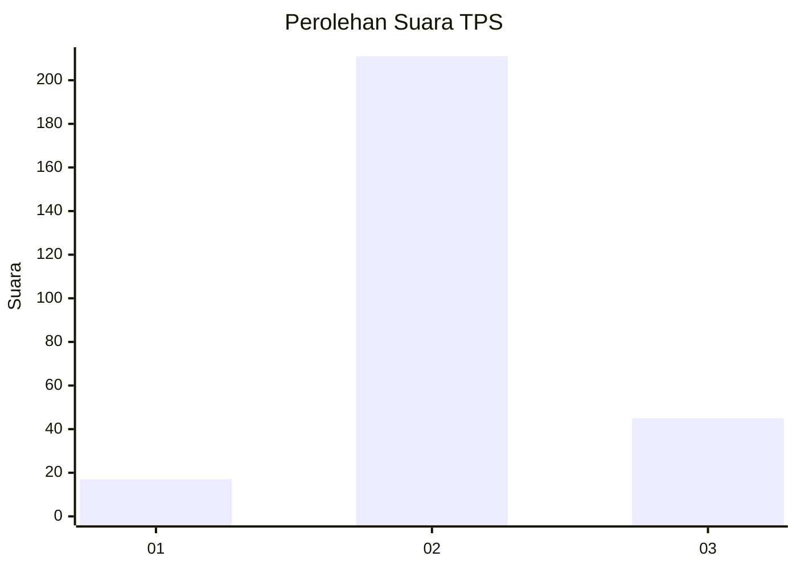
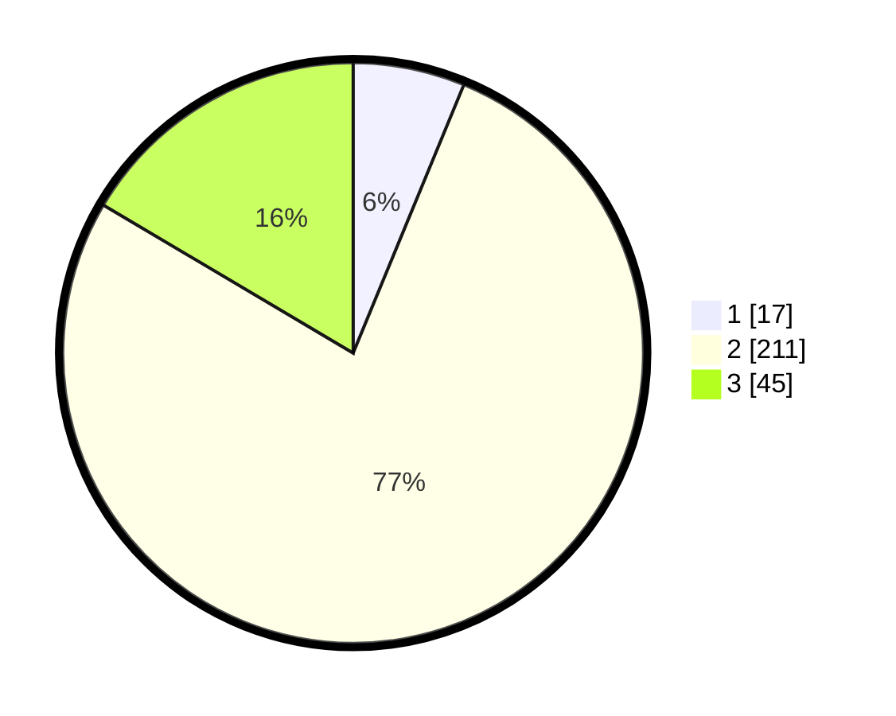

# Hasil

## Grafik

## Tabel

| No. | Nama Paslon    | Suara | Suara (raw) | Persentase |
|:--- |:-------------- | -----:| -----------:| ----------:|
| 1   | ANIES MUHAIMIN | 17    | [17][p-1]   | 6,23       |
| 2   | PRABOWO GIBRAN | 211   | [211][p-2]  | 77,29      |
| 3   | GANJAR MAHFUD  | 45    | [45][p-3]   | 16,48      |

[p-1]: https://github.com/gigit-pemilu/pemilu-2024-91-papua/blob/main/pilpres/hitung-suara/sub/91-papua/sub/71-kota-jayapura/sub/03-abepura/sub/1016-way-mhorock/sub/021-tps/sub/paslon-1.txt
[p-2]: https://github.com/gigit-pemilu/pemilu-2024-91-papua/blob/main/pilpres/hitung-suara/sub/91-papua/sub/71-kota-jayapura/sub/03-abepura/sub/1016-way-mhorock/sub/021-tps/sub/paslon-2.txt
[p-3]: https://github.com/gigit-pemilu/pemilu-2024-91-papua/blob/main/pilpres/hitung-suara/sub/91-papua/sub/71-kota-jayapura/sub/03-abepura/sub/1016-way-mhorock/sub/021-tps/sub/paslon-3.txt

## Foto C Plano

https://sirekap-obj-formc.kpu.go.id/fb8d/pemilu/ppwp/91/71/03/10/16/9171031016021-20240215-031337--4ac3ac69-c4fe-4894-a95e-dd82d8f464c8.jpg

https://sirekap-obj-formc.kpu.go.id/fb8d/pemilu/ppwp/91/71/03/10/16/9171031016021-20240215-031510--ca8d1b38-caa9-4aa6-880e-44247cce29d8.jpg

https://sirekap-obj-formc.kpu.go.id/fb8d/pemilu/ppwp/91/71/03/10/16/9171031016021-20240215-031634--cc2e9148-b169-41da-a93d-04813d414572.jpg

## Metadata

| Key        | Value               |
| ---------- | ------------------- |
| Time Stamp | 2024-02-16 10:30:29 |

