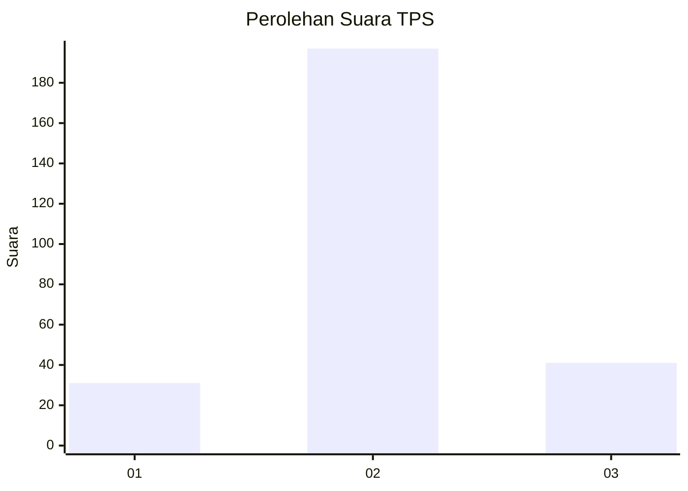
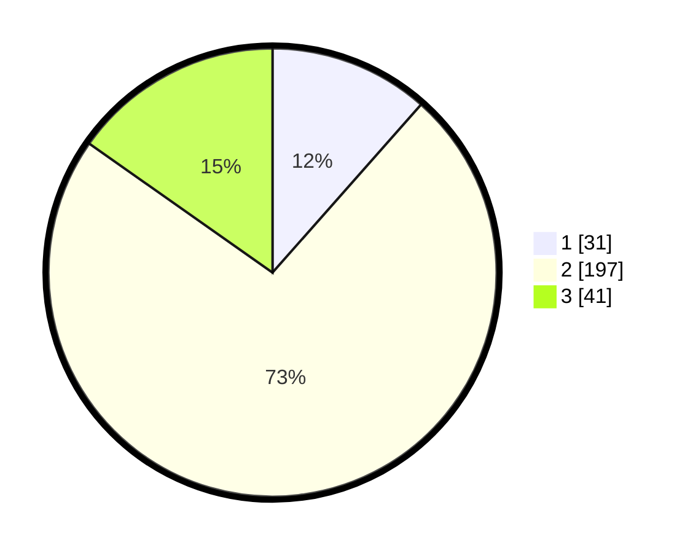

# Hasil

## Grafik

## Tabel

| No. | Nama Paslon    | Suara | Suara (raw) | Persentase |
|:--- |:-------------- | -----:| -----------:| ----------:|
| 1   | ANIES MUHAIMIN | 31    | [31][p-1]   | 11,52      |
| 2   | PRABOWO GIBRAN | 197   | [197][p-2]  | 73,23      |
| 3   | GANJAR MAHFUD  | 41    | [41][p-3]   | 15,24      |

[p-1]: https://github.com/gigit-pemilu/pemilu-2024-91-papua/blob/main/pilpres/hitung-suara/sub/91-papua/sub/71-kota-jayapura/sub/03-abepura/sub/1016-way-mhorock/sub/024-tps/sub/paslon-1.txt
[p-2]: https://github.com/gigit-pemilu/pemilu-2024-91-papua/blob/main/pilpres/hitung-suara/sub/91-papua/sub/71-kota-jayapura/sub/03-abepura/sub/1016-way-mhorock/sub/024-tps/sub/paslon-2.txt
[p-3]: https://github.com/gigit-pemilu/pemilu-2024-91-papua/blob/main/pilpres/hitung-suara/sub/91-papua/sub/71-kota-jayapura/sub/03-abepura/sub/1016-way-mhorock/sub/024-tps/sub/paslon-3.txt

## Foto C Plano

https://sirekap-obj-formc.kpu.go.id/53f0/pemilu/ppwp/91/71/03/10/16/9171031016024-20240215-090001--13200f1f-f07a-45b9-ad58-19834985e107.jpg

https://sirekap-obj-formc.kpu.go.id/53f0/pemilu/ppwp/91/71/03/10/16/9171031016024-20240215-090323--fb971e26-4eed-4f16-a0f6-60175b9f3c4f.jpg

https://sirekap-obj-formc.kpu.go.id/53f0/pemilu/ppwp/91/71/03/10/16/9171031016024-20240215-091007--78fd7383-2d9e-495c-976b-dbe3ee516aef.jpg

## Metadata

| Key        | Value               |
| ---------- | ------------------- |
| Time Stamp | 2024-02-16 10:30:29 |

