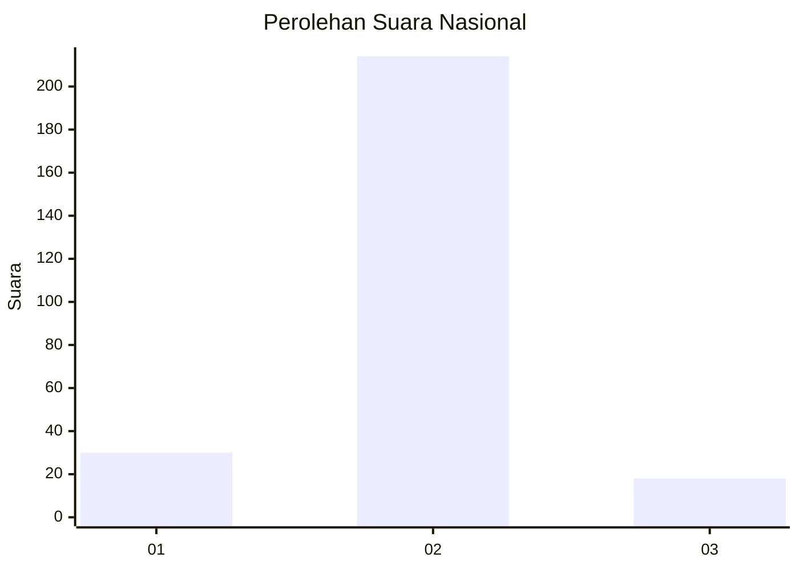
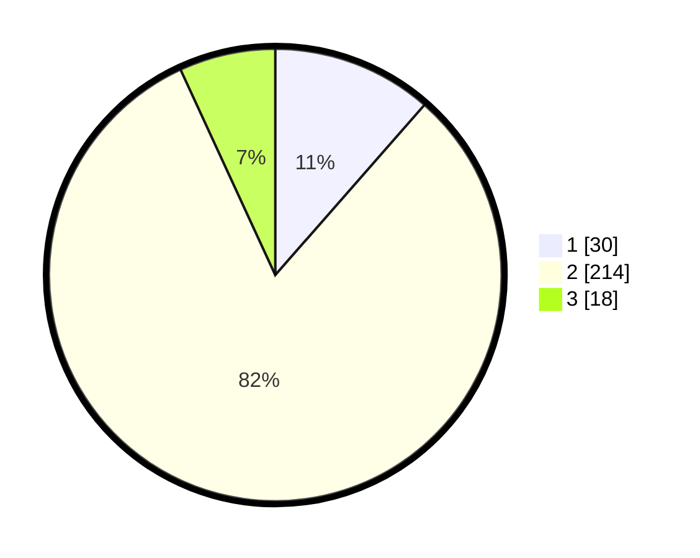

# Hasil

## Grafik

## Tabel

| No. | Nama Paslon    | Suara | Suara (raw) | Persentase |
|:--- |:-------------- | -----:| -----------:| ----------:|
| 1   | ANIES MUHAIMIN | 30    | [30][p-1]   | 11,45      |
| 2   | PRABOWO GIBRAN | 214   | [214][p-2]  | 81,68      |
| 3   | GANJAR MAHFUD  | 18    | [18][p-3]   | 6,87       |

[p-1]: https://github.com/gigit-pemilu/pemilu-2024/blob/main/pilpres/hitung-suara/sub/91-papua/sub/71-kota-jayapura/sub/03-abepura/sub/1016-way-mhorock/sub/028-tps/sub/paslon-1.txt
[p-2]: https://github.com/gigit-pemilu/pemilu-2024/blob/main/pilpres/hitung-suara/sub/91-papua/sub/71-kota-jayapura/sub/03-abepura/sub/1016-way-mhorock/sub/028-tps/sub/paslon-2.txt
[p-3]: https://github.com/gigit-pemilu/pemilu-2024/blob/main/pilpres/hitung-suara/sub/91-papua/sub/71-kota-jayapura/sub/03-abepura/sub/1016-way-mhorock/sub/028-tps/sub/paslon-3.txt

## Foto C Plano

https://sirekap-obj-formc.kpu.go.id/deb8/pemilu/ppwp/91/71/03/10/16/9171031016028-20240215-014023--2b4bce17-d00c-45da-85dd-384457bd4143.jpg

https://sirekap-obj-formc.kpu.go.id/deb8/pemilu/ppwp/91/71/03/10/16/9171031016028-20240215-014128--4e05061b-dca2-4e49-a480-ddbc6393d9ea.jpg

https://sirekap-obj-formc.kpu.go.id/deb8/pemilu/ppwp/91/71/03/10/16/9171031016028-20240215-014239--4a853e5a-3ddb-4ba0-af0a-060a52e6b751.jpg

## Metadata

| Key        | Value               |
| ---------- | ------------------- |
| Time Stamp | 2024-02-25 15:00:00 |

