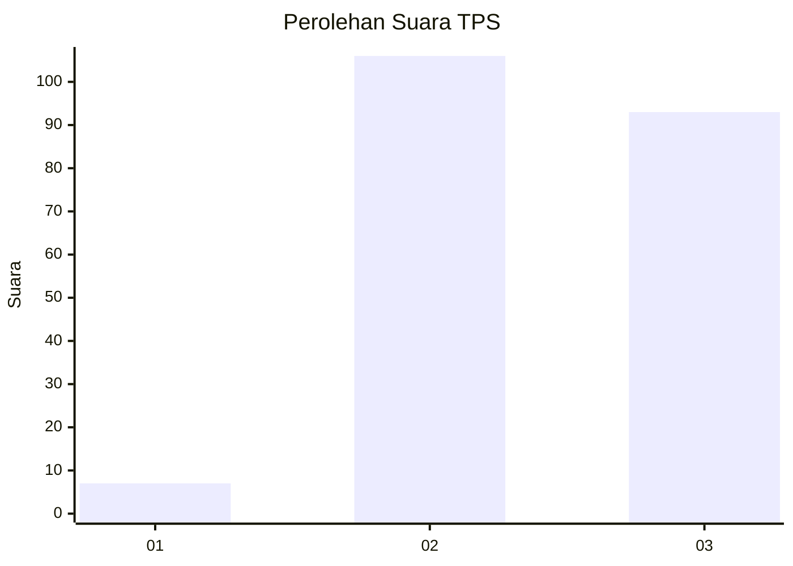
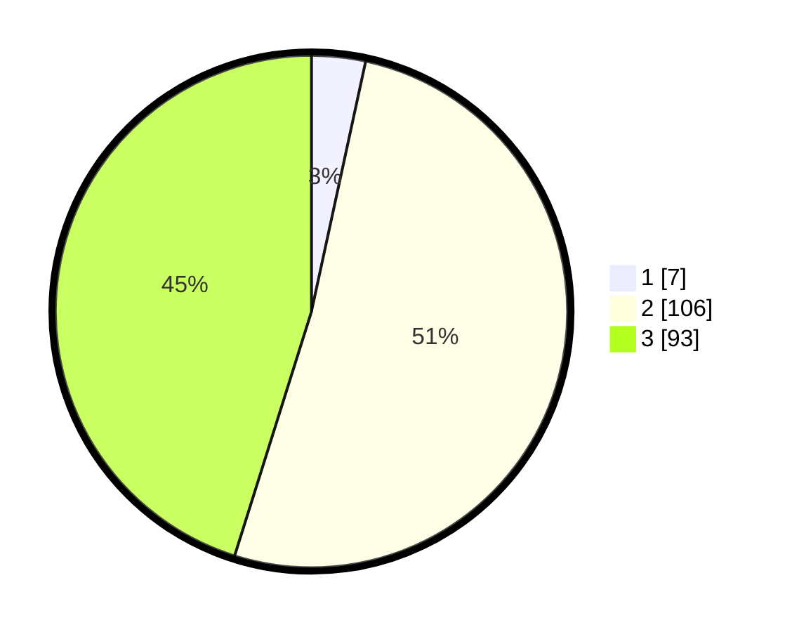

# Hasil

## Grafik

## Tabel

| No. | Nama Paslon    | Suara | Suara (raw) | Persentase |
|:--- |:-------------- | -----:| -----------:| ----------:|
| 1   | ANIES MUHAIMIN | 7     | [7][p-1]    | 3,40       |
| 2   | PRABOWO GIBRAN | 106   | [106][p-2]  | 51,46      |
| 3   | GANJAR MAHFUD  | 93    | [93][p-3]   | 45,15      |

[p-1]: https://github.com/gigit-pemilu/pemilu-2024-91-papua/blob/main/pilpres/hitung-suara/sub/91-papua/sub/71-kota-jayapura/sub/03-abepura/sub/2004-enggros/sub/001-tps/sub/paslon-1.txt
[p-2]: https://github.com/gigit-pemilu/pemilu-2024-91-papua/blob/main/pilpres/hitung-suara/sub/91-papua/sub/71-kota-jayapura/sub/03-abepura/sub/2004-enggros/sub/001-tps/sub/paslon-2.txt
[p-3]: https://github.com/gigit-pemilu/pemilu-2024-91-papua/blob/main/pilpres/hitung-suara/sub/91-papua/sub/71-kota-jayapura/sub/03-abepura/sub/2004-enggros/sub/001-tps/sub/paslon-3.txt

## Foto C Plano

https://sirekap-obj-formc.kpu.go.id/4f1f/pemilu/ppwp/91/71/03/20/04/9171032004001-20240218-204614--0961be25-9a2b-4fd6-9c19-e87786c035e6.jpg

https://sirekap-obj-formc.kpu.go.id/4f1f/pemilu/ppwp/91/71/03/20/04/9171032004001-20240218-210219--31d0ce4a-3f19-4df3-b621-f69911551bef.jpg

https://sirekap-obj-formc.kpu.go.id/4f1f/pemilu/ppwp/91/71/03/20/04/9171032004001-20240218-210305--efa2b027-7dc3-4aa1-ad06-deb0db65775b.jpg

## Metadata

| Key        | Value               |
| ---------- | ------------------- |
| Time Stamp | 2024-02-22 12:00:00 |

