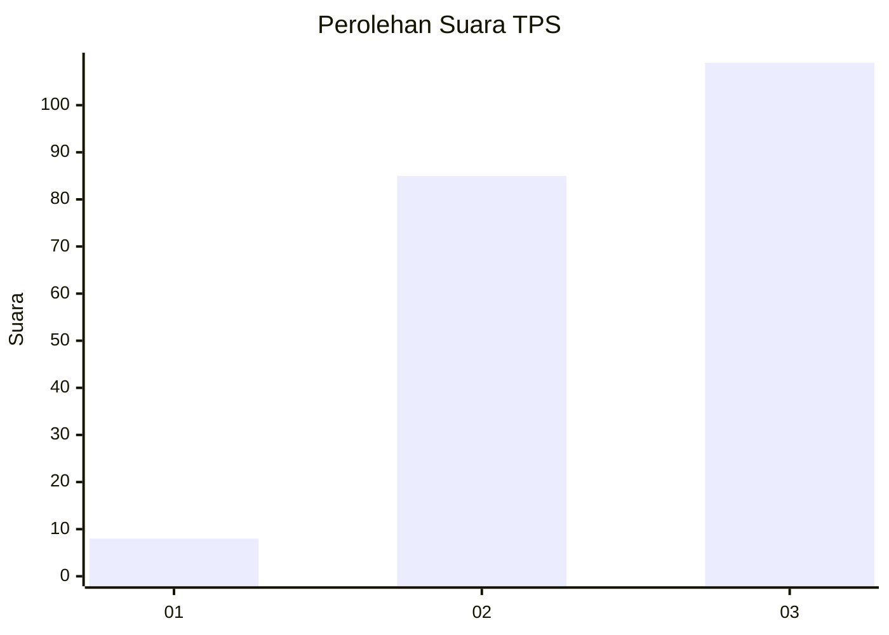
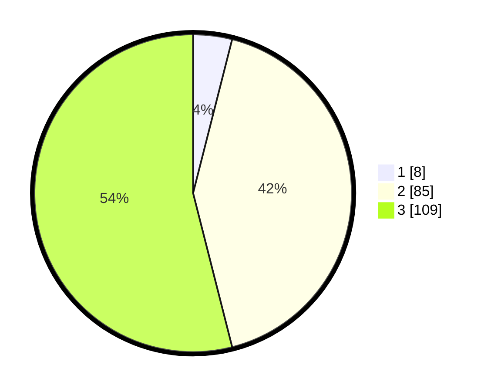

# Hasil

## Grafik

## Tabel

| No. | Nama Paslon    | Suara | Suara (raw) | Persentase |
|:--- |:-------------- | -----:| -----------:| ----------:|
| 1   | ANIES MUHAIMIN | 8     | [8][p-1]    | 3,96       |
| 2   | PRABOWO GIBRAN | 85    | [85][p-2]   | 42,08      |
| 3   | GANJAR MAHFUD  | 109   | [109][p-3]  | 53,96      |

[p-1]: https://github.com/gigit-pemilu/pemilu-2024-91-papua/blob/main/pilpres/hitung-suara/sub/91-papua/sub/71-kota-jayapura/sub/03-abepura/sub/2004-enggros/sub/002-tps/sub/paslon-1.txt
[p-2]: https://github.com/gigit-pemilu/pemilu-2024-91-papua/blob/main/pilpres/hitung-suara/sub/91-papua/sub/71-kota-jayapura/sub/03-abepura/sub/2004-enggros/sub/002-tps/sub/paslon-2.txt
[p-3]: https://github.com/gigit-pemilu/pemilu-2024-91-papua/blob/main/pilpres/hitung-suara/sub/91-papua/sub/71-kota-jayapura/sub/03-abepura/sub/2004-enggros/sub/002-tps/sub/paslon-3.txt

## Foto C Plano

https://sirekap-obj-formc.kpu.go.id/962a/pemilu/ppwp/91/71/03/20/04/9171032004002-20240219-131855--7dd35705-1fca-4ea8-a401-bb986b6274e2.jpg

https://sirekap-obj-formc.kpu.go.id/962a/pemilu/ppwp/91/71/03/20/04/9171032004002-20240219-132039--b51ce6b6-4723-4cf6-a45b-525955d0acb5.jpg

https://sirekap-obj-formc.kpu.go.id/962a/pemilu/ppwp/91/71/03/20/04/9171032004002-20240219-132215--c98da089-484b-4e86-91a6-c3d9a7f6bf9f.jpg

## Metadata

| Key        | Value               |
| ---------- | ------------------- |
| Time Stamp | 2024-02-22 12:00:00 |

