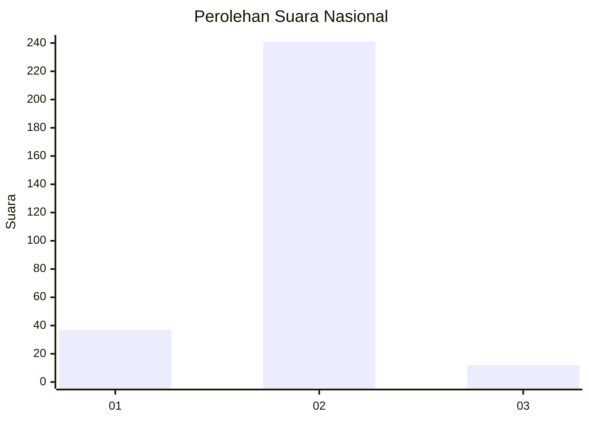
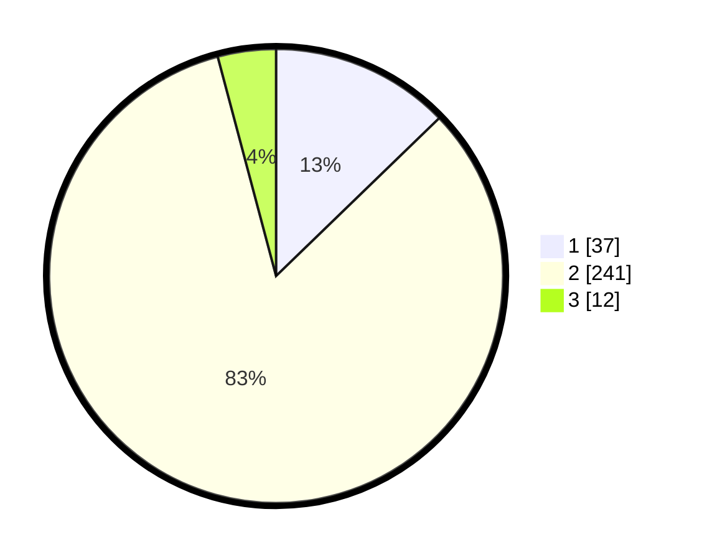

# Hasil

## Grafik

## Tabel

| No. | Nama Paslon    | Suara | Suara (raw) | Persentase |
|:--- |:-------------- | -----:| -----------:| ----------:|
| 1   | ANIES MUHAIMIN | 37    | [37][p-1]   | 12,76      |
| 2   | PRABOWO GIBRAN | 241   | [241][p-2]  | 83,10      |
| 3   | GANJAR MAHFUD  | 12    | [12][p-3]   | 4,14       |

[p-1]: https://github.com/gigit-pemilu/pemilu-2024/blob/main/pilpres/hitung-suara/sub/91-papua/sub/71-kota-jayapura/sub/03-abepura/sub/2007-koya-koso/sub/003-tps/sub/paslon-1.txt
[p-2]: https://github.com/gigit-pemilu/pemilu-2024/blob/main/pilpres/hitung-suara/sub/91-papua/sub/71-kota-jayapura/sub/03-abepura/sub/2007-koya-koso/sub/003-tps/sub/paslon-2.txt
[p-3]: https://github.com/gigit-pemilu/pemilu-2024/blob/main/pilpres/hitung-suara/sub/91-papua/sub/71-kota-jayapura/sub/03-abepura/sub/2007-koya-koso/sub/003-tps/sub/paslon-3.txt

## Foto C Plano

https://sirekap-obj-formc.kpu.go.id/34e6/pemilu/ppwp/91/71/03/20/07/9171032007003-20240215-021531--9ee537b1-4e47-47e1-9907-25ba79546a3a.jpg

https://sirekap-obj-formc.kpu.go.id/34e6/pemilu/ppwp/91/71/03/20/07/9171032007003-20240215-021802--ee4cfbd6-cad1-427e-8632-73e8e953e1a4.jpg

https://sirekap-obj-formc.kpu.go.id/34e6/pemilu/ppwp/91/71/03/20/07/9171032007003-20240215-021946--114a665a-06f0-4713-afe0-a411fdcf57e2.jpg

## Metadata

| Key        | Value               |
| ---------- | ------------------- |
| Time Stamp | 2024-02-16 10:30:29 |

