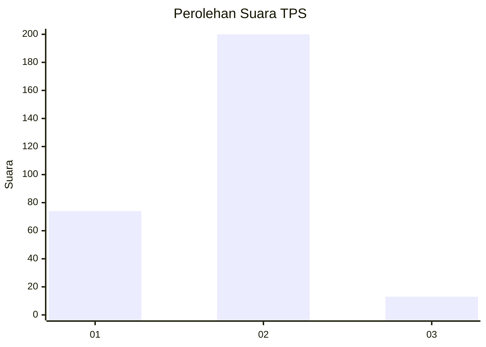
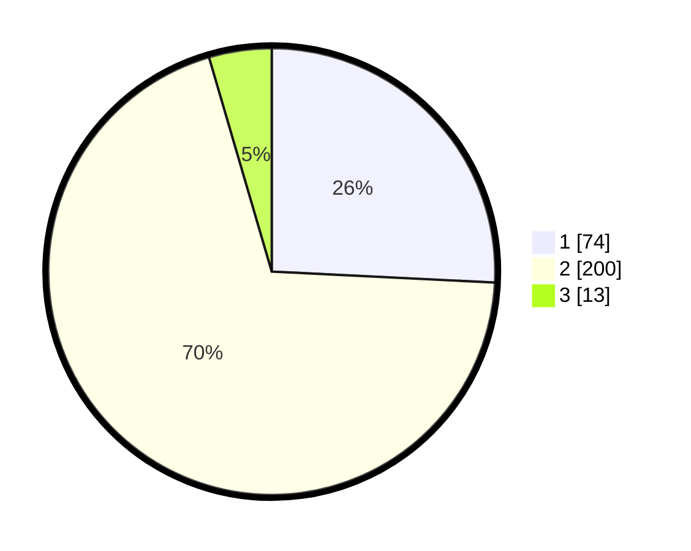

# Hasil

## Grafik

## Tabel

| No. | Nama Paslon    | Suara | Suara (raw) | Persentase |
|:--- |:-------------- | -----:| -----------:| ----------:|
| 1   | ANIES MUHAIMIN | 74    | [74][p-1]   | 25,78      |
| 2   | PRABOWO GIBRAN | 200   | [200][p-2]  | 69,69      |
| 3   | GANJAR MAHFUD  | 13    | [13][p-3]   | 4,53       |

[p-1]: https://github.com/gigit-pemilu/pemilu-2024-91-papua/blob/main/pilpres/hitung-suara/sub/91-papua/sub/71-kota-jayapura/sub/03-abepura/sub/2007-koya-koso/sub/005-tps/sub/paslon-1.txt
[p-2]: https://github.com/gigit-pemilu/pemilu-2024-91-papua/blob/main/pilpres/hitung-suara/sub/91-papua/sub/71-kota-jayapura/sub/03-abepura/sub/2007-koya-koso/sub/005-tps/sub/paslon-2.txt
[p-3]: https://github.com/gigit-pemilu/pemilu-2024-91-papua/blob/main/pilpres/hitung-suara/sub/91-papua/sub/71-kota-jayapura/sub/03-abepura/sub/2007-koya-koso/sub/005-tps/sub/paslon-3.txt

## Foto C Plano

https://sirekap-obj-formc.kpu.go.id/144d/pemilu/ppwp/91/71/03/20/07/9171032007005-20240215-001138--dd39fc22-1256-4b38-9c1a-a6044682c5d1.jpg

https://sirekap-obj-formc.kpu.go.id/144d/pemilu/ppwp/91/71/03/20/07/9171032007005-20240215-001305--72071b39-a794-4173-958b-e7368e05ff42.jpg

https://sirekap-obj-formc.kpu.go.id/144d/pemilu/ppwp/91/71/03/20/07/9171032007005-20240215-001758--4b7b4e8d-62b7-45ac-9ba1-9924ddcc43fd.jpg

## Metadata

| Key        | Value               |
| ---------- | ------------------- |
| Time Stamp | 2024-02-16 10:30:29 |

