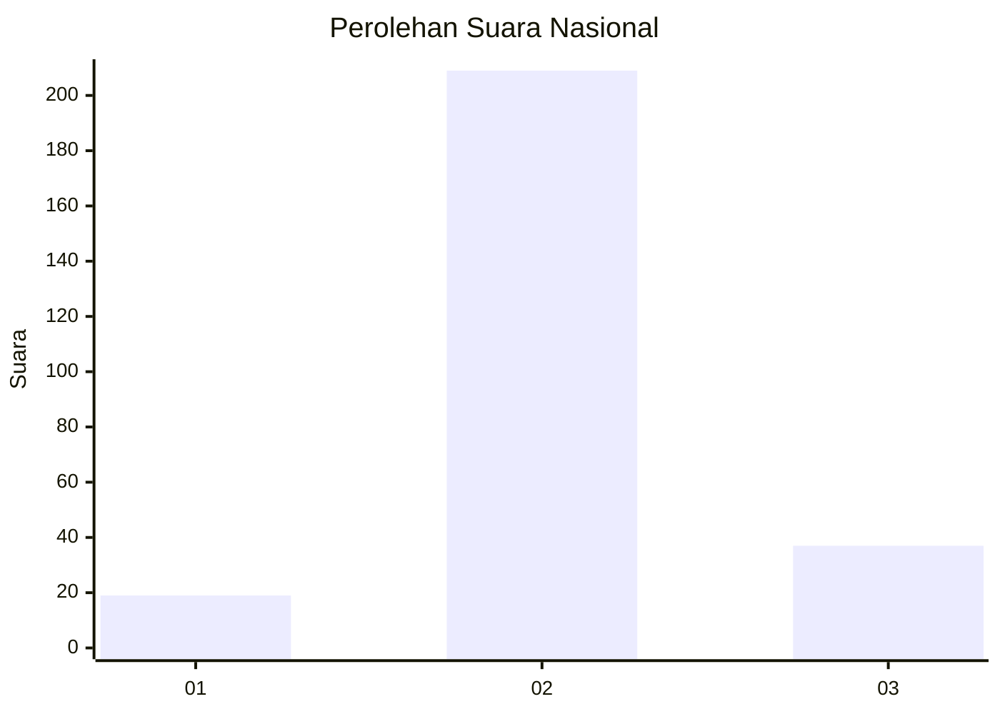
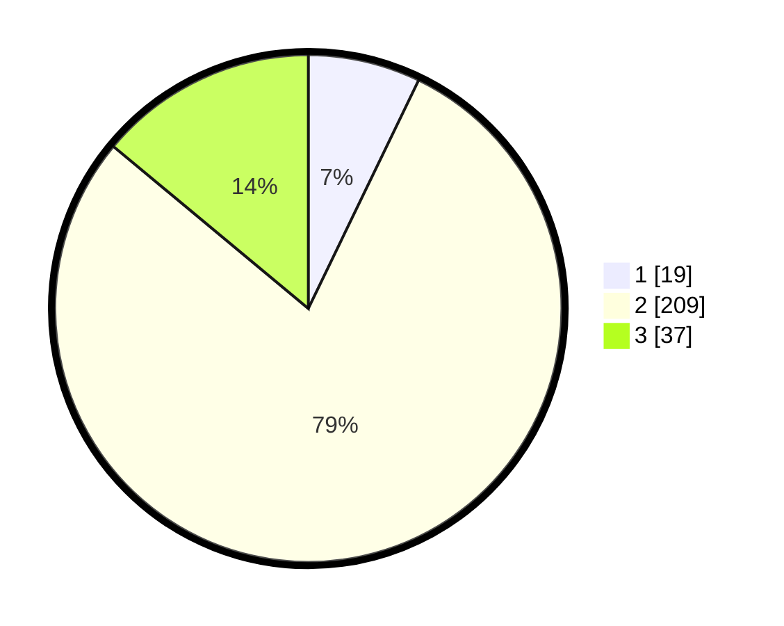

# Hasil

## Grafik

## Tabel

| No. | Nama Paslon    | Suara | Suara (raw) | Persentase |
|:--- |:-------------- | -----:| -----------:| ----------:|
| 1   | ANIES MUHAIMIN | 19    | [19][p-1]   | 7,17       |
| 2   | PRABOWO GIBRAN | 209   | [209][p-2]  | 78,87      |
| 3   | GANJAR MAHFUD  | 37    | [37][p-3]   | 13,96      |

[p-1]: https://github.com/gigit-pemilu/pemilu-2024/blob/main/pilpres/hitung-suara/sub/91-papua/sub/71-kota-jayapura/sub/04-muara-tami/sub/1004-koya-barat/sub/001-tps/sub/paslon-1.txt
[p-2]: https://github.com/gigit-pemilu/pemilu-2024/blob/main/pilpres/hitung-suara/sub/91-papua/sub/71-kota-jayapura/sub/04-muara-tami/sub/1004-koya-barat/sub/001-tps/sub/paslon-2.txt
[p-3]: https://github.com/gigit-pemilu/pemilu-2024/blob/main/pilpres/hitung-suara/sub/91-papua/sub/71-kota-jayapura/sub/04-muara-tami/sub/1004-koya-barat/sub/001-tps/sub/paslon-3.txt

## Foto C Plano

https://sirekap-obj-formc.kpu.go.id/499b/pemilu/ppwp/91/71/04/10/04/9171041004001-20240214-222901--c69d4b2d-de2c-49a8-88cf-a19c8b3172dd.jpg

https://sirekap-obj-formc.kpu.go.id/499b/pemilu/ppwp/91/71/04/10/04/9171041004001-20240214-224057--769a09f5-ee96-4dd0-86ac-b0cd87e60490.jpg

https://sirekap-obj-formc.kpu.go.id/499b/pemilu/ppwp/91/71/04/10/04/9171041004001-20240214-224430--5eaeb567-2541-4ff9-ab47-a3a9df0e40ec.jpg

## Metadata

| Key        | Value               |
| ---------- | ------------------- |
| Time Stamp | 2024-02-16 08:00:28 |

