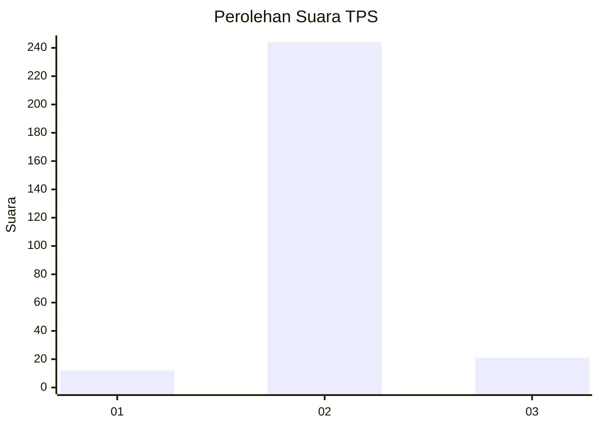
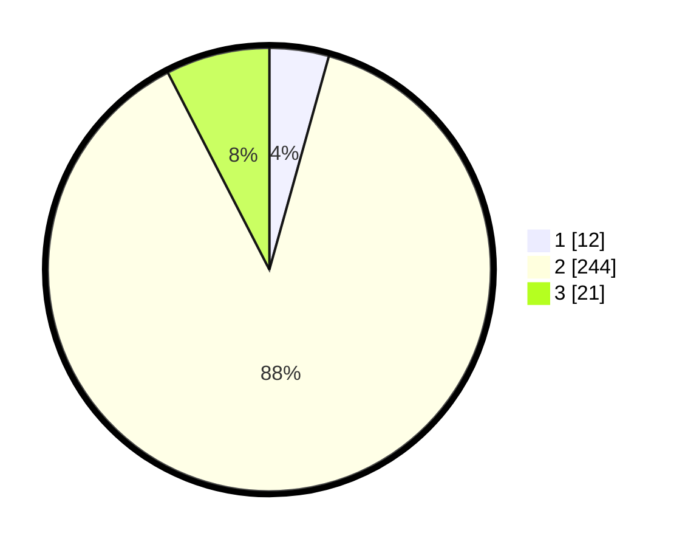

# Hasil

## Grafik

## Tabel

| No. | Nama Paslon    | Suara | Suara (raw) | Persentase |
|:--- |:-------------- | -----:| -----------:| ----------:|
| 1   | ANIES MUHAIMIN | 12    | [12][p-1]   | 4,33       |
| 2   | PRABOWO GIBRAN | 244   | [244][p-2]  | 88,09      |
| 3   | GANJAR MAHFUD  | 21    | [21][p-3]   | 7,58       |

[p-1]: https://github.com/gigit-pemilu/pemilu-2024-91-papua/blob/main/pilpres/hitung-suara/sub/91-papua/sub/71-kota-jayapura/sub/04-muara-tami/sub/1004-koya-barat/sub/004-tps/sub/paslon-1.txt
[p-2]: https://github.com/gigit-pemilu/pemilu-2024-91-papua/blob/main/pilpres/hitung-suara/sub/91-papua/sub/71-kota-jayapura/sub/04-muara-tami/sub/1004-koya-barat/sub/004-tps/sub/paslon-2.txt
[p-3]: https://github.com/gigit-pemilu/pemilu-2024-91-papua/blob/main/pilpres/hitung-suara/sub/91-papua/sub/71-kota-jayapura/sub/04-muara-tami/sub/1004-koya-barat/sub/004-tps/sub/paslon-3.txt

## Foto C Plano

https://sirekap-obj-formc.kpu.go.id/82fc/pemilu/ppwp/91/71/04/10/04/9171041004004-20240216-125038--57427c31-2409-44c3-a3ed-f2a312e8b393.jpg

https://sirekap-obj-formc.kpu.go.id/82fc/pemilu/ppwp/91/71/04/10/04/9171041004004-20240216-125051--452baf0e-7f77-406d-ba39-ead83cce7e17.jpg

## Metadata

| Key        | Value               |
| ---------- | ------------------- |
| Time Stamp | 2024-02-16 13:30:32 |

