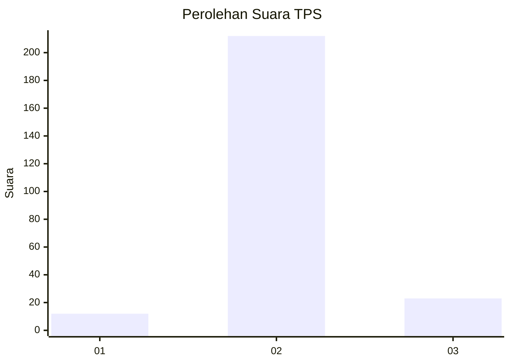
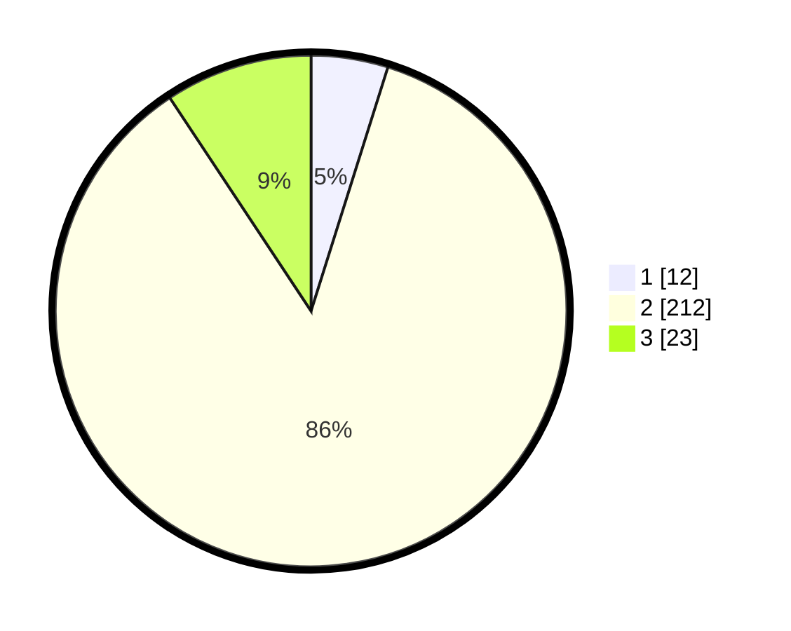

# Hasil

## Grafik

## Tabel

| No. | Nama Paslon    | Suara | Suara (raw) | Persentase |
|:--- |:-------------- | -----:| -----------:| ----------:|
| 1   | ANIES MUHAIMIN | 12    | [12][p-1]   | 4,86       |
| 2   | PRABOWO GIBRAN | 212   | [212][p-2]  | 85,83      |
| 3   | GANJAR MAHFUD  | 23    | [23][p-3]   | 9,31       |

[p-1]: https://github.com/gigit-pemilu/pemilu-2024-91-papua/blob/main/pilpres/hitung-suara/sub/91-papua/sub/71-kota-jayapura/sub/04-muara-tami/sub/1004-koya-barat/sub/015-tps/sub/paslon-1.txt
[p-2]: https://github.com/gigit-pemilu/pemilu-2024-91-papua/blob/main/pilpres/hitung-suara/sub/91-papua/sub/71-kota-jayapura/sub/04-muara-tami/sub/1004-koya-barat/sub/015-tps/sub/paslon-2.txt
[p-3]: https://github.com/gigit-pemilu/pemilu-2024-91-papua/blob/main/pilpres/hitung-suara/sub/91-papua/sub/71-kota-jayapura/sub/04-muara-tami/sub/1004-koya-barat/sub/015-tps/sub/paslon-3.txt

## Foto C Plano

https://sirekap-obj-formc.kpu.go.id/9ad4/pemilu/ppwp/91/71/04/10/04/9171041004015-20240215-084807--128a60d8-96e5-473a-9a74-7cbc8712a529.jpg

https://sirekap-obj-formc.kpu.go.id/9ad4/pemilu/ppwp/91/71/04/10/04/9171041004015-20240215-085059--d1279f83-a8f7-4dc1-a540-1e7af1d3b62b.jpg

https://sirekap-obj-formc.kpu.go.id/9ad4/pemilu/ppwp/91/71/04/10/04/9171041004015-20240215-085229--3af34956-71ee-45e9-9122-0c1a1249b668.jpg

## Metadata

| Key        | Value               |
| ---------- | ------------------- |
| Time Stamp | 2024-02-16 08:00:28 |

