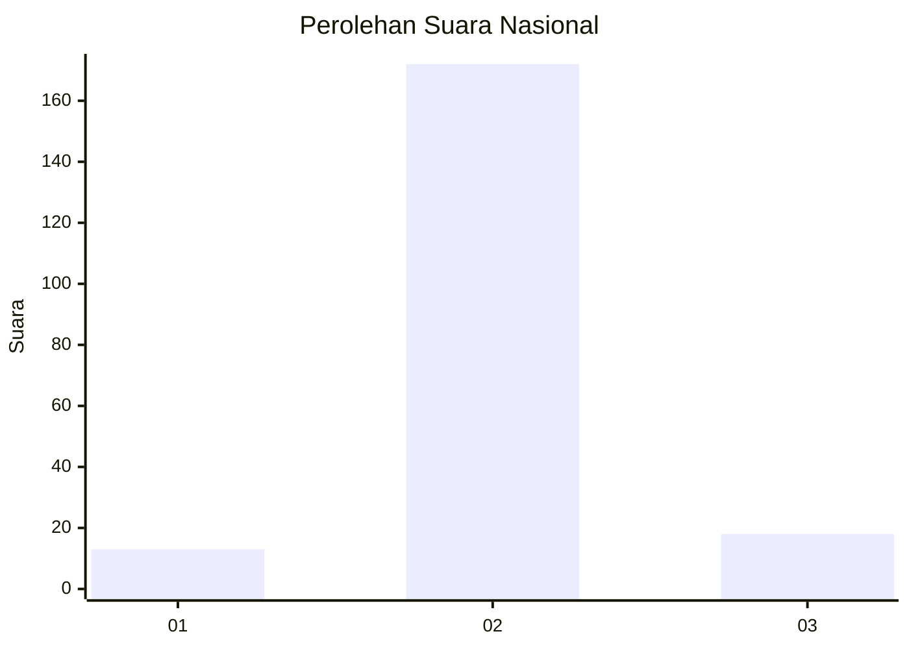
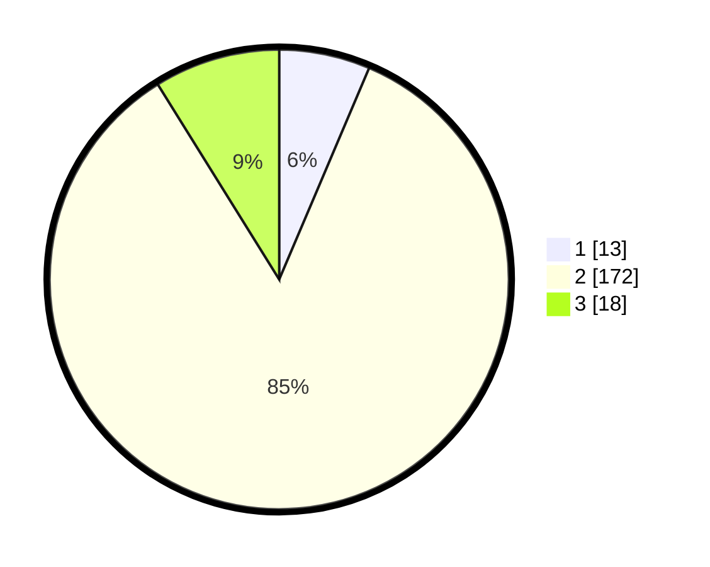

# Hasil

## Grafik

## Tabel

| No. | Nama Paslon    | Suara | Suara (raw) | Persentase |
|:--- |:-------------- | -----:| -----------:| ----------:|
| 1   | ANIES MUHAIMIN | 13    | [13][p-1]   | 6,40       |
| 2   | PRABOWO GIBRAN | 172   | [172][p-2]  | 84,73      |
| 3   | GANJAR MAHFUD  | 18    | [18][p-3]   | 8,87       |

[p-1]: https://github.com/gigit-pemilu/pemilu-2024/blob/main/pilpres/hitung-suara/sub/91-papua/sub/71-kota-jayapura/sub/04-muara-tami/sub/1004-koya-barat/sub/020-tps/sub/paslon-1.txt
[p-2]: https://github.com/gigit-pemilu/pemilu-2024/blob/main/pilpres/hitung-suara/sub/91-papua/sub/71-kota-jayapura/sub/04-muara-tami/sub/1004-koya-barat/sub/020-tps/sub/paslon-2.txt
[p-3]: https://github.com/gigit-pemilu/pemilu-2024/blob/main/pilpres/hitung-suara/sub/91-papua/sub/71-kota-jayapura/sub/04-muara-tami/sub/1004-koya-barat/sub/020-tps/sub/paslon-3.txt

## Foto C Plano

https://sirekap-obj-formc.kpu.go.id/1a32/pemilu/ppwp/91/71/04/10/04/9171041004020-20240215-041556--eea4cb1f-ab8a-4d34-984e-c838d619b223.jpg

https://sirekap-obj-formc.kpu.go.id/1a32/pemilu/ppwp/91/71/04/10/04/9171041004020-20240215-041538--b5701690-8859-402d-bca0-2c9319e60a0f.jpg

https://sirekap-obj-formc.kpu.go.id/1a32/pemilu/ppwp/91/71/04/10/04/9171041004020-20240215-041508--ceb967d2-7692-452a-ac2c-b98eb11d0171.jpg

## Metadata

| Key        | Value               |
| ---------- | ------------------- |
| Time Stamp | 2024-02-25 12:00:00 |

