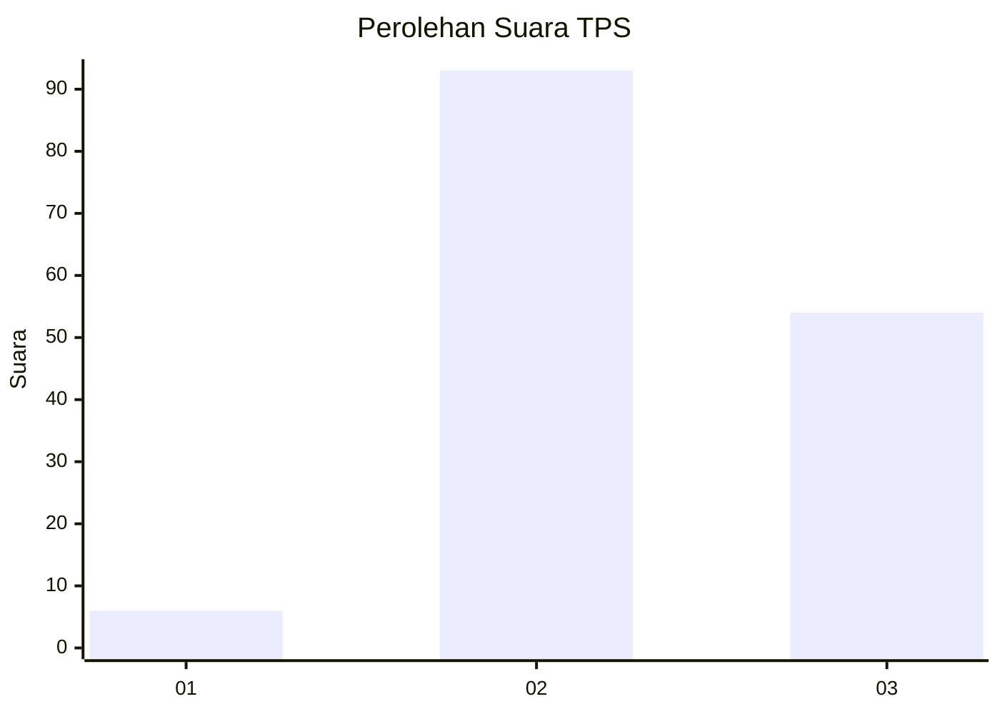
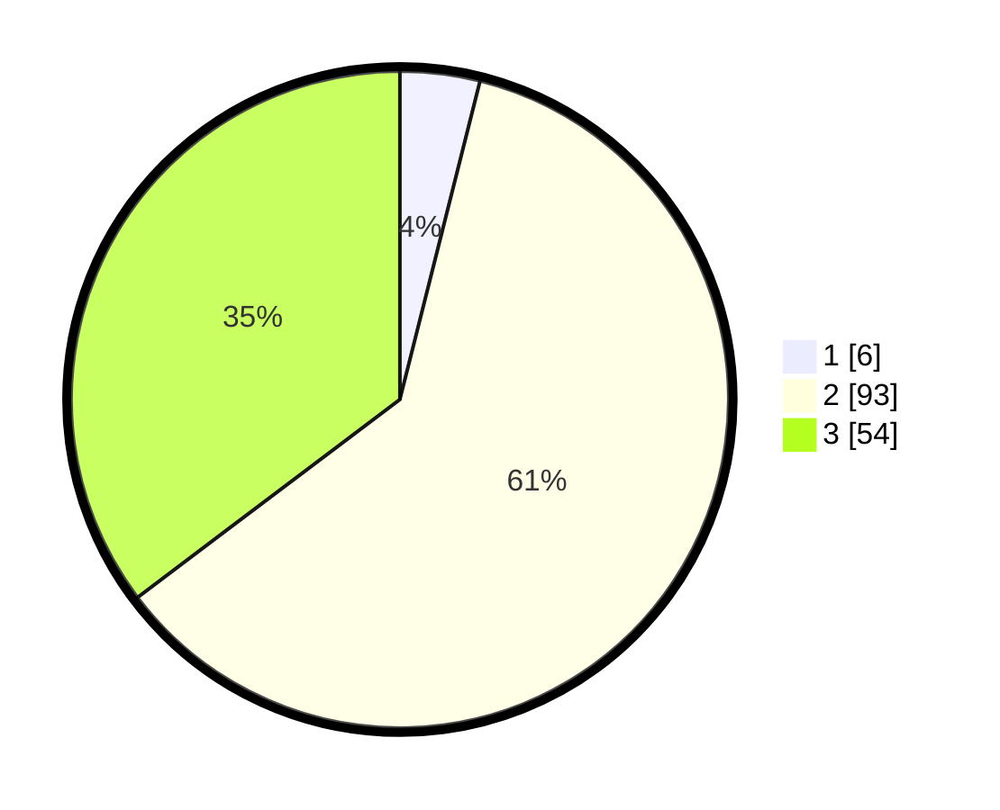

# Hasil

## Grafik

## Tabel

| No. | Nama Paslon    | Suara | Suara (raw) | Persentase |
|:--- |:-------------- | -----:| -----------:| ----------:|
| 1   | ANIES MUHAIMIN | 6     | [6][p-1]    | 3,92       |
| 2   | PRABOWO GIBRAN | 93    | [93][p-2]   | 60,78      |
| 3   | GANJAR MAHFUD  | 54    | [54][p-3]   | 35,29      |

[p-1]: https://github.com/gigit-pemilu/pemilu-2024-91-papua/blob/main/pilpres/hitung-suara/sub/91-papua/sub/71-kota-jayapura/sub/04-muara-tami/sub/2001-skouw-mabo/sub/002-tps/sub/paslon-1.txt
[p-2]: https://github.com/gigit-pemilu/pemilu-2024-91-papua/blob/main/pilpres/hitung-suara/sub/91-papua/sub/71-kota-jayapura/sub/04-muara-tami/sub/2001-skouw-mabo/sub/002-tps/sub/paslon-2.txt
[p-3]: https://github.com/gigit-pemilu/pemilu-2024-91-papua/blob/main/pilpres/hitung-suara/sub/91-papua/sub/71-kota-jayapura/sub/04-muara-tami/sub/2001-skouw-mabo/sub/002-tps/sub/paslon-3.txt

## Foto C Plano

https://sirekap-obj-formc.kpu.go.id/a5b8/pemilu/ppwp/91/71/04/20/01/9171042001002-20240223-095628--77584169-46fb-427c-9c58-44a0625d113e.jpg

https://sirekap-obj-formc.kpu.go.id/a5b8/pemilu/ppwp/91/71/04/20/01/9171042001002-20240223-095712--c17e07b3-288f-4c43-a6a5-f8042b8a12d7.jpg

https://sirekap-obj-formc.kpu.go.id/a5b8/pemilu/ppwp/91/71/04/20/01/9171042001002-20240223-095752--c23557a2-02c8-4b50-9d6e-c5aedfb9e24a.jpg

## Metadata

| Key        | Value               |
| ---------- | ------------------- |
| Time Stamp | 2024-02-25 14:00:00 |

