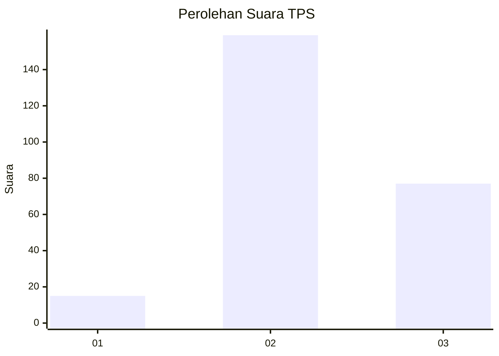
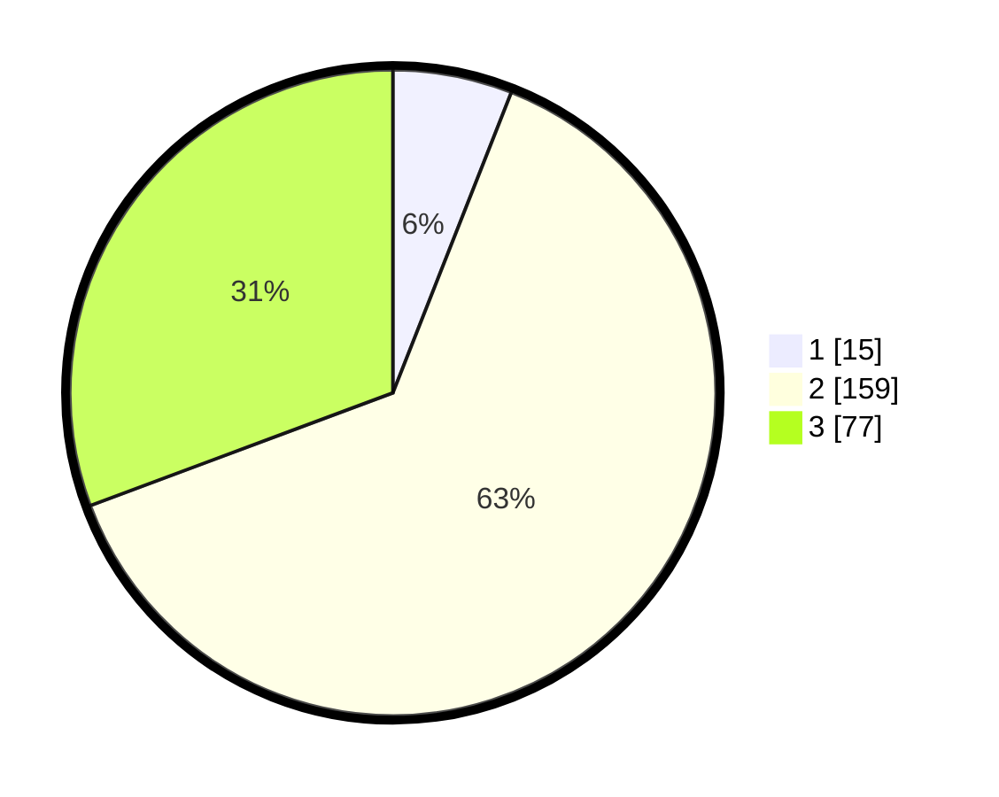

# Hasil

## Grafik

## Tabel

| No. | Nama Paslon    | Suara | Suara (raw) | Persentase |
|:--- |:-------------- | -----:| -----------:| ----------:|
| 1   | ANIES MUHAIMIN | 15    | [15][p-1]   | 5,98       |
| 2   | PRABOWO GIBRAN | 159   | [159][p-2]  | 63,35      |
| 3   | GANJAR MAHFUD  | 77    | [77][p-3]   | 30,68      |

[p-1]: https://github.com/gigit-pemilu/pemilu-2024-91-papua/blob/main/pilpres/hitung-suara/sub/91-papua/sub/71-kota-jayapura/sub/04-muara-tami/sub/2002-skouw-yambe/sub/001-tps/sub/paslon-1.txt
[p-2]: https://github.com/gigit-pemilu/pemilu-2024-91-papua/blob/main/pilpres/hitung-suara/sub/91-papua/sub/71-kota-jayapura/sub/04-muara-tami/sub/2002-skouw-yambe/sub/001-tps/sub/paslon-2.txt
[p-3]: https://github.com/gigit-pemilu/pemilu-2024-91-papua/blob/main/pilpres/hitung-suara/sub/91-papua/sub/71-kota-jayapura/sub/04-muara-tami/sub/2002-skouw-yambe/sub/001-tps/sub/paslon-3.txt

## Foto C Plano

https://sirekap-obj-formc.kpu.go.id/b86d/pemilu/ppwp/91/71/04/20/02/9171042002001-20240222-083440--c8ca75e7-b005-4d2b-a0df-23ce9a756694.jpg

https://sirekap-obj-formc.kpu.go.id/b86d/pemilu/ppwp/91/71/04/20/02/9171042002001-20240222-083731--97cc7629-3279-4b66-8edc-fdeea412bc79.jpg

https://sirekap-obj-formc.kpu.go.id/b86d/pemilu/ppwp/91/71/04/20/02/9171042002001-20240222-083825--177f6bac-70ab-4ba8-abd1-38c9c37be257.jpg

## Metadata

| Key        | Value               |
| ---------- | ------------------- |
| Time Stamp | 2024-02-22 11:00:00 |

