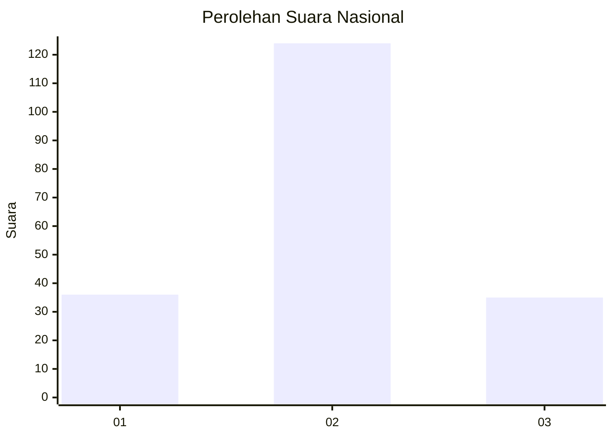
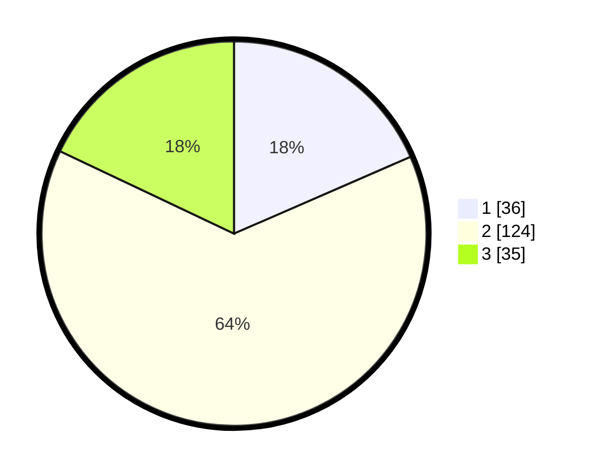

# Hasil

## Grafik

## Tabel

| No. | Nama Paslon    | Suara | Suara (raw) | Persentase |
|:--- |:-------------- | -----:| -----------:| ----------:|
| 1   | ANIES MUHAIMIN | 36    | [36][p-1]   | 18,46      |
| 2   | PRABOWO GIBRAN | 124   | [124][p-2]  | 63,59      |
| 3   | GANJAR MAHFUD  | 35    | [35][p-3]   | 17,95      |

[p-1]: https://github.com/gigit-pemilu/pemilu-2024/blob/main/pilpres/hitung-suara/sub/91-papua/sub/71-kota-jayapura/sub/04-muara-tami/sub/2008-mosso/sub/001-tps/sub/paslon-1.txt
[p-2]: https://github.com/gigit-pemilu/pemilu-2024/blob/main/pilpres/hitung-suara/sub/91-papua/sub/71-kota-jayapura/sub/04-muara-tami/sub/2008-mosso/sub/001-tps/sub/paslon-2.txt
[p-3]: https://github.com/gigit-pemilu/pemilu-2024/blob/main/pilpres/hitung-suara/sub/91-papua/sub/71-kota-jayapura/sub/04-muara-tami/sub/2008-mosso/sub/001-tps/sub/paslon-3.txt

## Foto C Plano

https://sirekap-obj-formc.kpu.go.id/9921/pemilu/ppwp/91/71/04/20/08/9171042008001-20240221-091023--e561ada0-6b4b-49eb-93b7-51ea8e59a6a7.jpg

https://sirekap-obj-formc.kpu.go.id/9921/pemilu/ppwp/91/71/04/20/08/9171042008001-20240221-091321--c3e80689-ae3c-40be-9961-bcf8855ba524.jpg

https://sirekap-obj-formc.kpu.go.id/9921/pemilu/ppwp/91/71/04/20/08/9171042008001-20240221-091602--af9c653d-4807-4750-9f1a-1e18cc74eed2.jpg

## Metadata

| Key        | Value               |
| ---------- | ------------------- |
| Time Stamp | 2024-02-22 15:00:00 |

## DATA PEMILIH TETAP

Jumlah pemilih dalam DPT: **239**.
 * L: **129**.
 * P: **110**.

## DATA PENGGUNA HAK PILIH

Jumlah pengguna hak pilih dalam DPT: **141**.
 * L: **81**.
 * P: **60**.

Jumlah pengguna hak pilih dalam DPTb: **24**.
 * L: **12**.
 * P: **12**.

Jumlah pengguna hak pilih dalam DPK: **36**.
 * L: **21**.
 * P: **15**.

Jumlah pengguna hak pilih: **201**.
 * L: **114**.
 * P: **87**.

## JUMLAH SUARA SAH DAN TIDAK SAH

JUMLAH SELURUH SUARA SAH: **195**.

JUMLAH SUARA TIDAK SAH: **6**.

JUMLAH SELURUH SUARA SAH DAN SUARA TIDAK SAH: **201**.

