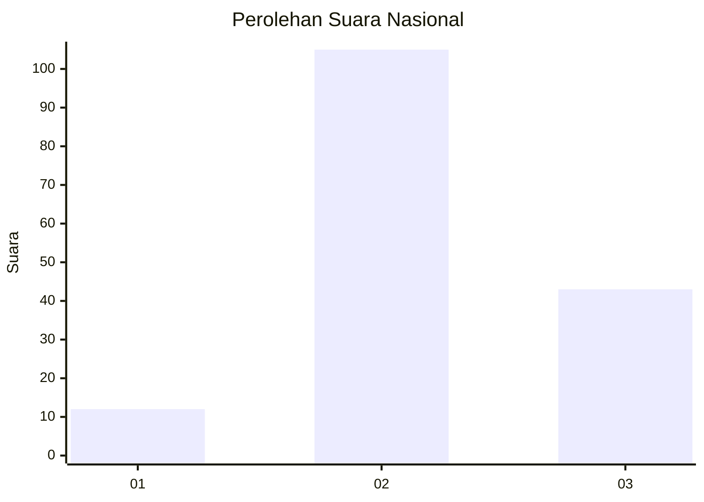

# Hasil

## Grafik

## Tabel

| No. | Nama Paslon    | Suara | Suara (raw) | Persentase |
|:--- |:-------------- | -----:| -----------:| ----------:|
| 1   | ANIES MUHAIMIN | 12    | [12][p-1]   | 7,50       |
| 2   | PRABOWO GIBRAN | 105   | [105][p-2]  | 65,63      |
| 3   | GANJAR MAHFUD  | 43    | [43][p-3]   | 26,88      |

[p-1]: https://github.com/gigit-pemilu/pemilu-2024/blob/main/pilpres/hitung-suara/sub/91-papua/sub/71-kota-jayapura/sub/05-heram/sub/1001-hedam/sub/001-tps/sub/paslon-1.txt
[p-2]: https://github.com/gigit-pemilu/pemilu-2024/blob/main/pilpres/hitung-suara/sub/91-papua/sub/71-kota-jayapura/sub/05-heram/sub/1001-hedam/sub/001-tps/sub/paslon-2.txt
[p-3]: https://github.com/gigit-pemilu/pemilu-2024/blob/main/pilpres/hitung-suara/sub/91-papua/sub/71-kota-jayapura/sub/05-heram/sub/1001-hedam/sub/001-tps/sub/paslon-3.txt

## Foto C Plano

https://sirekap-obj-formc.kpu.go.id/7aef/pemilu/ppwp/91/71/05/10/01/9171051001001-20240215-055618--92cd70fc-eff0-48e0-b123-61cc5bf15725.jpg

https://sirekap-obj-formc.kpu.go.id/7aef/pemilu/ppwp/91/71/05/10/01/9171051001001-20240215-055821--c31de128-cc74-4fef-a708-1a4a91a332f1.jpg

https://sirekap-obj-formc.kpu.go.id/7aef/pemilu/ppwp/91/71/05/10/01/9171051001001-20240215-060005--a7355321-bbd6-4bde-a276-f9207c1b3856.jpg

## Metadata

| Key        | Value               |
| ---------- | ------------------- |
| Time Stamp | 2024-02-25 11:00:00 |

