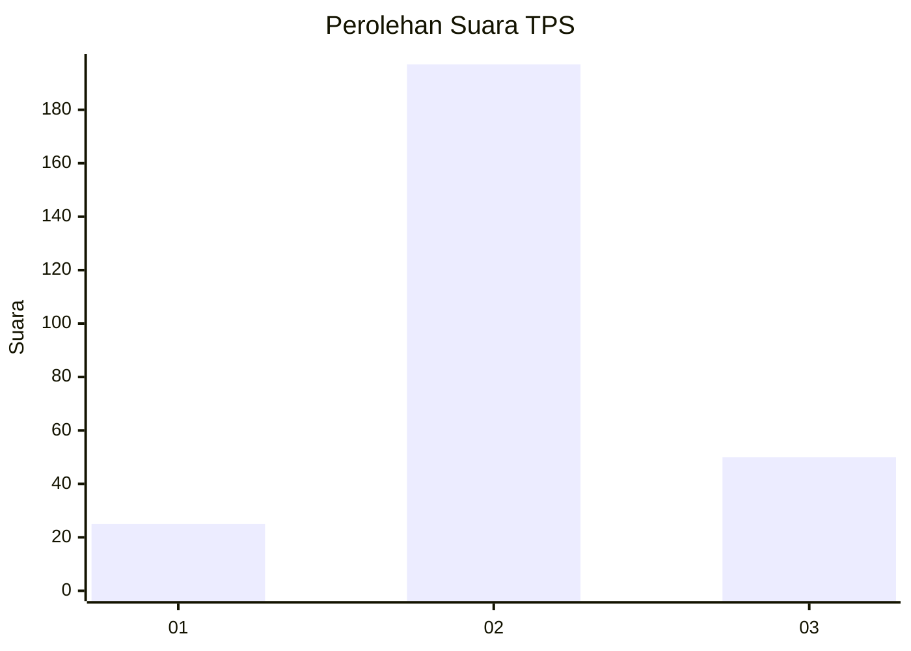
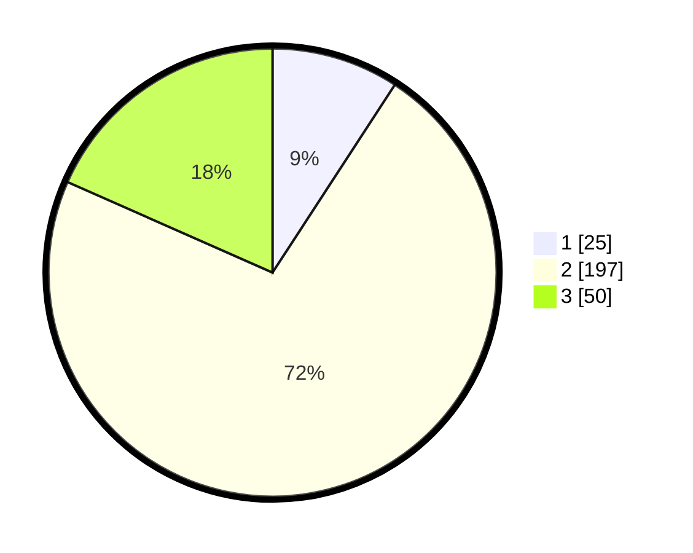

# Hasil

## Grafik

## Tabel

| No. | Nama Paslon    | Suara | Suara (raw) | Persentase |
|:--- |:-------------- | -----:| -----------:| ----------:|
| 1   | ANIES MUHAIMIN | 25    | [25][p-1]   | 9,19       |
| 2   | PRABOWO GIBRAN | 197   | [197][p-2]  | 72,43      |
| 3   | GANJAR MAHFUD  | 50    | [50][p-3]   | 18,38      |

[p-1]: https://github.com/gigit-pemilu/pemilu-2024-91-papua/blob/main/pilpres/hitung-suara/sub/91-papua/sub/71-kota-jayapura/sub/05-heram/sub/1001-hedam/sub/005-tps/sub/paslon-1.txt
[p-2]: https://github.com/gigit-pemilu/pemilu-2024-91-papua/blob/main/pilpres/hitung-suara/sub/91-papua/sub/71-kota-jayapura/sub/05-heram/sub/1001-hedam/sub/005-tps/sub/paslon-2.txt
[p-3]: https://github.com/gigit-pemilu/pemilu-2024-91-papua/blob/main/pilpres/hitung-suara/sub/91-papua/sub/71-kota-jayapura/sub/05-heram/sub/1001-hedam/sub/005-tps/sub/paslon-3.txt

## Foto C Plano

https://sirekap-obj-formc.kpu.go.id/862e/pemilu/ppwp/91/71/05/10/01/9171051001005-20240215-024754--a2165470-62e1-404a-93b5-ca106d0fb8b0.jpg

https://sirekap-obj-formc.kpu.go.id/862e/pemilu/ppwp/91/71/05/10/01/9171051001005-20240215-025004--2830fc07-7299-4951-9395-1e70a0b68890.jpg

https://sirekap-obj-formc.kpu.go.id/862e/pemilu/ppwp/91/71/05/10/01/9171051001005-20240215-025137--bc0b11d0-9f19-4421-a576-d7dc71765b18.jpg

## Metadata

| Key        | Value               |
| ---------- | ------------------- |
| Time Stamp | 2024-02-16 10:30:29 |

