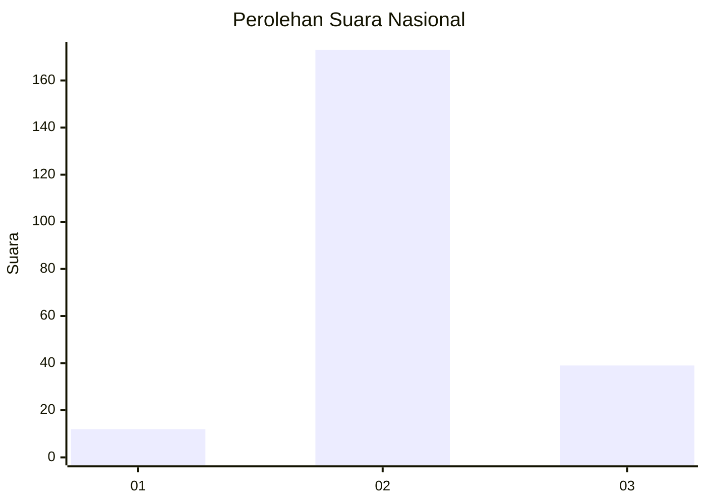

# Hasil

## Grafik

## Tabel

| No. | Nama Paslon    | Suara | Suara (raw) | Persentase |
|:--- |:-------------- | -----:| -----------:| ----------:|
| 1   | ANIES MUHAIMIN | 12    | [12][p-1]   | 5,36       |
| 2   | PRABOWO GIBRAN | 173   | [173][p-2]  | 77,23      |
| 3   | GANJAR MAHFUD  | 39    | [39][p-3]   | 17,41      |

[p-1]: https://github.com/gigit-pemilu/pemilu-2024/blob/main/pilpres/hitung-suara/sub/91-papua/sub/71-kota-jayapura/sub/05-heram/sub/1001-hedam/sub/012-tps/sub/paslon-1.txt
[p-2]: https://github.com/gigit-pemilu/pemilu-2024/blob/main/pilpres/hitung-suara/sub/91-papua/sub/71-kota-jayapura/sub/05-heram/sub/1001-hedam/sub/012-tps/sub/paslon-2.txt
[p-3]: https://github.com/gigit-pemilu/pemilu-2024/blob/main/pilpres/hitung-suara/sub/91-papua/sub/71-kota-jayapura/sub/05-heram/sub/1001-hedam/sub/012-tps/sub/paslon-3.txt

## Foto C Plano

https://sirekap-obj-formc.kpu.go.id/9d0b/pemilu/ppwp/91/71/05/10/01/9171051001012-20240215-183748--2f3f700c-332d-4170-88db-563d5951e966.jpg

https://sirekap-obj-formc.kpu.go.id/9d0b/pemilu/ppwp/91/71/05/10/01/9171051001012-20240215-183757--9d8f9dbc-2b65-48d5-91d9-d992ce1940f4.jpg

https://sirekap-obj-formc.kpu.go.id/9d0b/pemilu/ppwp/91/71/05/10/01/9171051001012-20240215-183801--15d33187-0af4-4582-b3cb-12ab97fb17c6.jpg

## Metadata

| Key        | Value               |
| ---------- | ------------------- |
| Time Stamp | 2024-02-16 10:30:29 |

