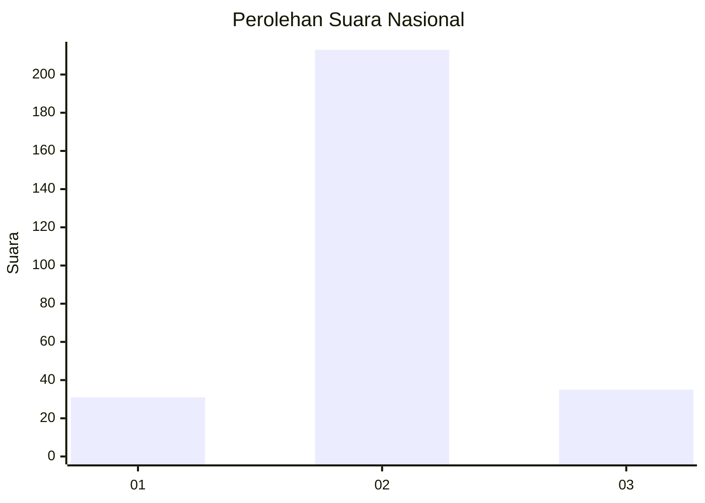
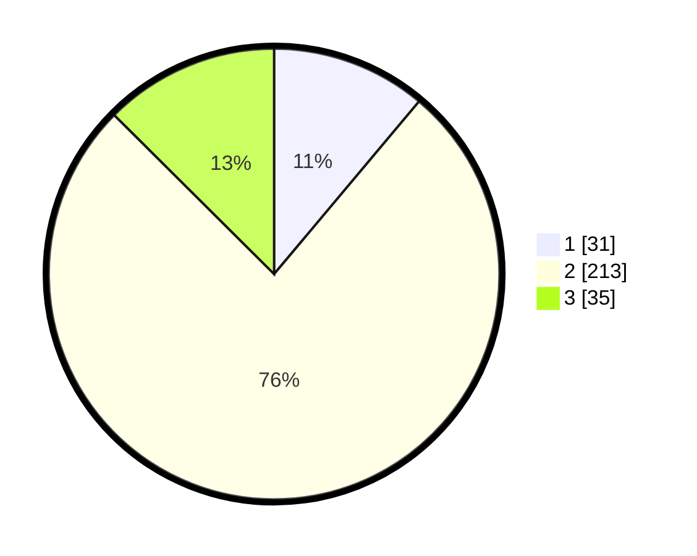

# Hasil

## Grafik

## Tabel

| No. | Nama Paslon    | Suara | Suara (raw) | Persentase |
|:--- |:-------------- | -----:| -----------:| ----------:|
| 1   | ANIES MUHAIMIN | 31    | [31][p-1]   | 11,11      |
| 2   | PRABOWO GIBRAN | 213   | [213][p-2]  | 76,34      |
| 3   | GANJAR MAHFUD  | 35    | [35][p-3]   | 12,54      |

[p-1]: https://github.com/gigit-pemilu/pemilu-2024/blob/main/pilpres/hitung-suara/sub/91-papua/sub/71-kota-jayapura/sub/05-heram/sub/1001-hedam/sub/033-tps/sub/paslon-1.txt
[p-2]: https://github.com/gigit-pemilu/pemilu-2024/blob/main/pilpres/hitung-suara/sub/91-papua/sub/71-kota-jayapura/sub/05-heram/sub/1001-hedam/sub/033-tps/sub/paslon-2.txt
[p-3]: https://github.com/gigit-pemilu/pemilu-2024/blob/main/pilpres/hitung-suara/sub/91-papua/sub/71-kota-jayapura/sub/05-heram/sub/1001-hedam/sub/033-tps/sub/paslon-3.txt

## Foto C Plano

https://sirekap-obj-formc.kpu.go.id/4526/pemilu/ppwp/91/71/05/10/01/9171051001033-20240215-032517--1183ff57-ea08-4ae7-90c2-8f3f1f1db7de.jpg

https://sirekap-obj-formc.kpu.go.id/4526/pemilu/ppwp/91/71/05/10/01/9171051001033-20240215-032535--a9b1329b-caf1-44b2-aa5f-27a3d55be3e5.jpg

## Metadata

| Key        | Value               |
| ---------- | ------------------- |
| Time Stamp | 2024-02-24 22:31:28 |

