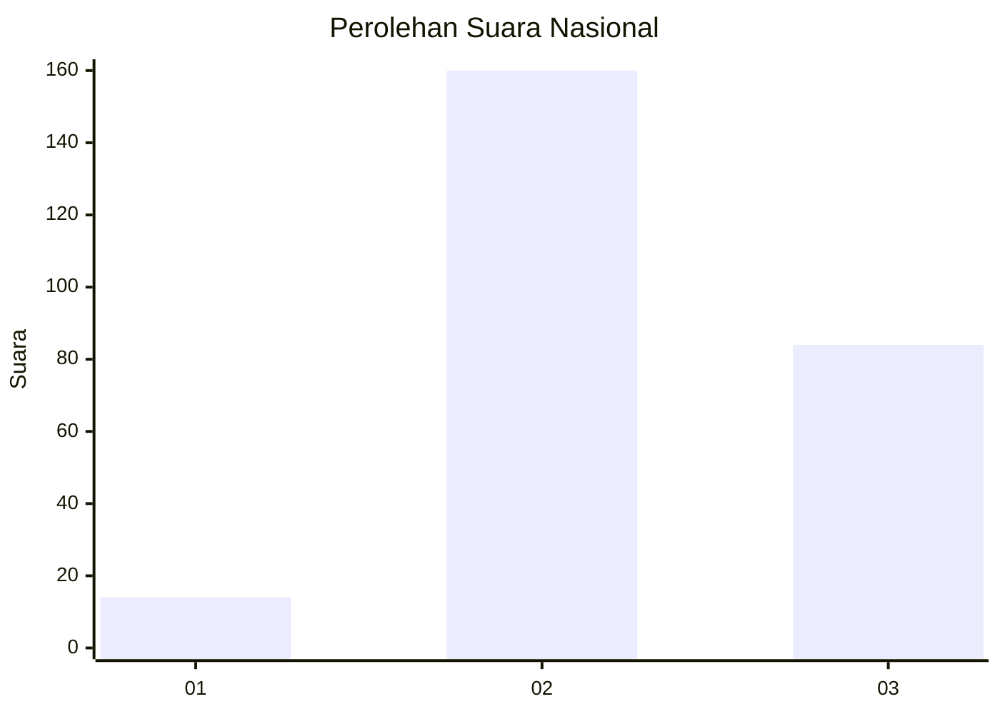
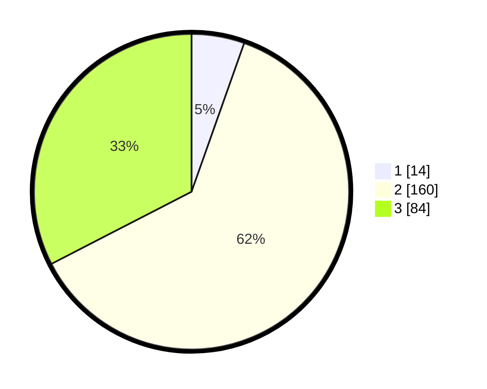

# Hasil

## Grafik

## Tabel

| No. | Nama Paslon    | Suara | Suara (raw) | Persentase |
|:--- |:-------------- | -----:| -----------:| ----------:|
| 1   | ANIES MUHAIMIN | 14    | [14][p-1]   | 5,43       |
| 2   | PRABOWO GIBRAN | 160   | [160][p-2]  | 62,02      |
| 3   | GANJAR MAHFUD  | 84    | [84][p-3]   | 32,56      |

[p-1]: https://github.com/gigit-pemilu/pemilu-2024/blob/main/pilpres/hitung-suara/sub/91-papua/sub/71-kota-jayapura/sub/05-heram/sub/1002-waena/sub/052-tps/sub/paslon-1.txt
[p-2]: https://github.com/gigit-pemilu/pemilu-2024/blob/main/pilpres/hitung-suara/sub/91-papua/sub/71-kota-jayapura/sub/05-heram/sub/1002-waena/sub/052-tps/sub/paslon-2.txt
[p-3]: https://github.com/gigit-pemilu/pemilu-2024/blob/main/pilpres/hitung-suara/sub/91-papua/sub/71-kota-jayapura/sub/05-heram/sub/1002-waena/sub/052-tps/sub/paslon-3.txt

## Foto C Plano

https://sirekap-obj-formc.kpu.go.id/ef8c/pemilu/ppwp/91/71/05/10/02/9171051002052-20240214-224118--8995c04f-23de-49e6-abd0-f402bae96d9f.jpg

https://sirekap-obj-formc.kpu.go.id/ef8c/pemilu/ppwp/91/71/05/10/02/9171051002052-20240214-224413--b080ad6a-11aa-43c3-a160-5976ce40a32d.jpg

https://sirekap-obj-formc.kpu.go.id/ef8c/pemilu/ppwp/91/71/05/10/02/9171051002052-20240214-224635--d618d02b-e9d3-42c6-9695-fae74953eeba.jpg

## Metadata

| Key        | Value               |
| ---------- | ------------------- |
| Time Stamp | 2024-02-24 22:31:28 |

