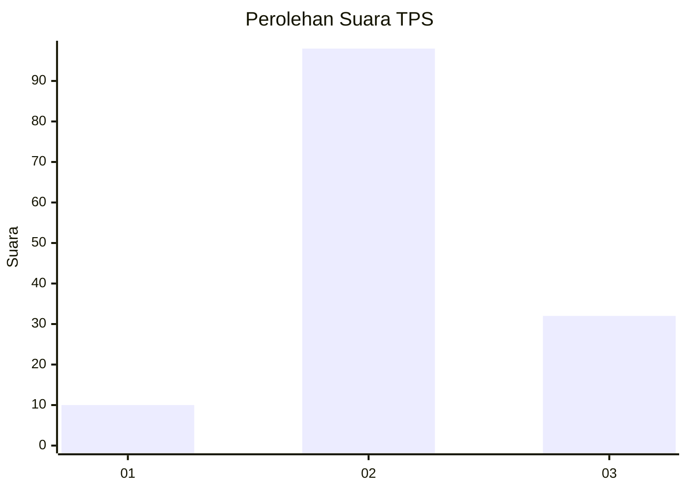
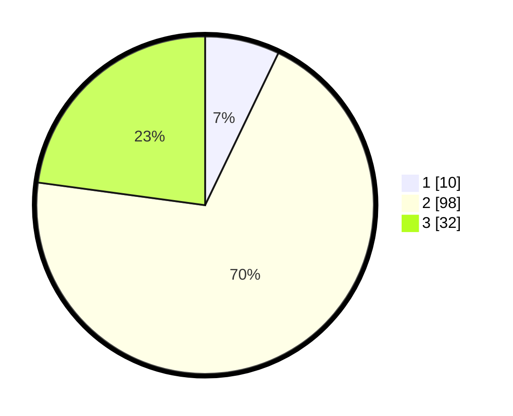

# Hasil

## Grafik

## Tabel

| No. | Nama Paslon    | Suara | Suara (raw) | Persentase |
|:--- |:-------------- | -----:| -----------:| ----------:|
| 1   | ANIES MUHAIMIN | 10    | [10][p-1]   | 7,14       |
| 2   | PRABOWO GIBRAN | 98    | [98][p-2]   | 70,00      |
| 3   | GANJAR MAHFUD  | 32    | [32][p-3]   | 22,86      |

[p-1]: https://github.com/gigit-pemilu/pemilu-2024-91-papua/blob/main/pilpres/hitung-suara/sub/91-papua/sub/71-kota-jayapura/sub/05-heram/sub/1004-yabansai/sub/006-tps/sub/paslon-1.txt
[p-2]: https://github.com/gigit-pemilu/pemilu-2024-91-papua/blob/main/pilpres/hitung-suara/sub/91-papua/sub/71-kota-jayapura/sub/05-heram/sub/1004-yabansai/sub/006-tps/sub/paslon-2.txt
[p-3]: https://github.com/gigit-pemilu/pemilu-2024-91-papua/blob/main/pilpres/hitung-suara/sub/91-papua/sub/71-kota-jayapura/sub/05-heram/sub/1004-yabansai/sub/006-tps/sub/paslon-3.txt

## Foto C Plano

https://sirekap-obj-formc.kpu.go.id/cd2b/pemilu/ppwp/91/71/05/10/04/9171051004006-20240214-213921--8daeb199-c602-40b3-a1a2-f0920108483c.jpg

https://sirekap-obj-formc.kpu.go.id/cd2b/pemilu/ppwp/91/71/05/10/04/9171051004006-20240214-221209--5587c425-bbd0-461f-9142-7a27fc6688e8.jpg

https://sirekap-obj-formc.kpu.go.id/cd2b/pemilu/ppwp/91/71/05/10/04/9171051004006-20240214-221237--489288e6-6b40-49fe-8cc1-024ad1f386a5.jpg

## Metadata

| Key        | Value               |
| ---------- | ------------------- |
| Time Stamp | 2024-02-16 10:30:29 |

