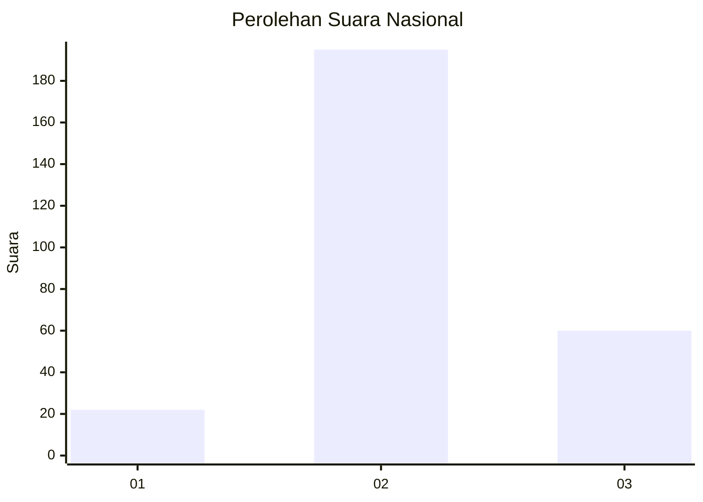
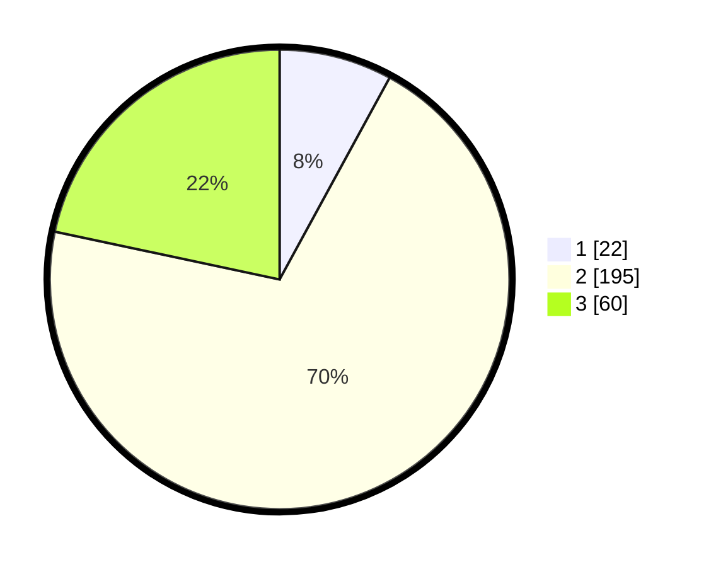

# Hasil

## Grafik

## Tabel

| No. | Nama Paslon    | Suara | Suara (raw) | Persentase |
|:--- |:-------------- | -----:| -----------:| ----------:|
| 1   | ANIES MUHAIMIN | 22    | [22][p-1]   | 7,94       |
| 2   | PRABOWO GIBRAN | 195   | [195][p-2]  | 70,40      |
| 3   | GANJAR MAHFUD  | 60    | [60][p-3]   | 21,66      |

[p-1]: https://github.com/gigit-pemilu/pemilu-2024/blob/main/pilpres/hitung-suara/sub/91-papua/sub/71-kota-jayapura/sub/05-heram/sub/1004-yabansai/sub/008-tps/sub/paslon-1.txt
[p-2]: https://github.com/gigit-pemilu/pemilu-2024/blob/main/pilpres/hitung-suara/sub/91-papua/sub/71-kota-jayapura/sub/05-heram/sub/1004-yabansai/sub/008-tps/sub/paslon-2.txt
[p-3]: https://github.com/gigit-pemilu/pemilu-2024/blob/main/pilpres/hitung-suara/sub/91-papua/sub/71-kota-jayapura/sub/05-heram/sub/1004-yabansai/sub/008-tps/sub/paslon-3.txt

## Foto C Plano

https://sirekap-obj-formc.kpu.go.id/f39b/pemilu/ppwp/91/71/05/10/04/9171051004008-20240214-203800--f6a59c09-ca2a-4d02-bed7-ef2355956afb.jpg

https://sirekap-obj-formc.kpu.go.id/f39b/pemilu/ppwp/91/71/05/10/04/9171051004008-20240214-204112--007e5951-6159-4528-8537-fdf9c87cd67b.jpg

https://sirekap-obj-formc.kpu.go.id/f39b/pemilu/ppwp/91/71/05/10/04/9171051004008-20240214-204249--04083f51-dcad-4f4f-a2fb-fce974cc79c1.jpg

## Metadata

| Key        | Value               |
| ---------- | ------------------- |
| Time Stamp | 2024-02-16 10:30:29 |

