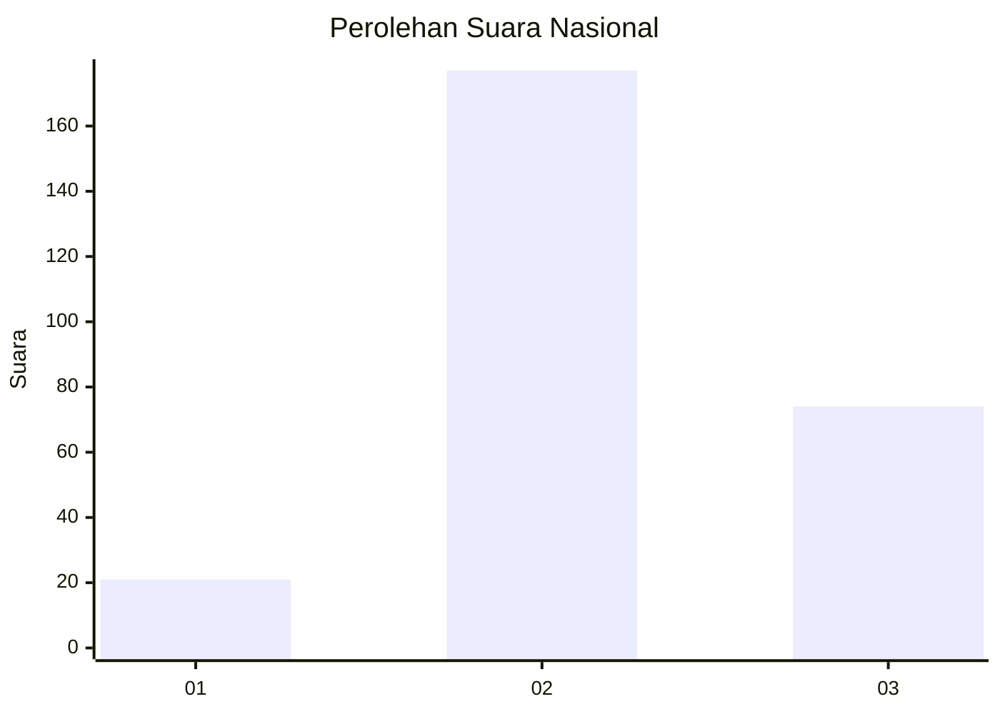

# Hasil

## Grafik

## Tabel

| No. | Nama Paslon    | Suara | Suara (raw) | Persentase |
|:--- |:-------------- | -----:| -----------:| ----------:|
| 1   | ANIES MUHAIMIN | 21    | [21][p-1]   | 7,72       |
| 2   | PRABOWO GIBRAN | 177   | [177][p-2]  | 65,07      |
| 3   | GANJAR MAHFUD  | 74    | [74][p-3]   | 27,21      |

[p-1]: https://github.com/gigit-pemilu/pemilu-2024/blob/main/pilpres/hitung-suara/sub/91-papua/sub/71-kota-jayapura/sub/05-heram/sub/1004-yabansai/sub/009-tps/sub/paslon-1.txt
[p-2]: https://github.com/gigit-pemilu/pemilu-2024/blob/main/pilpres/hitung-suara/sub/91-papua/sub/71-kota-jayapura/sub/05-heram/sub/1004-yabansai/sub/009-tps/sub/paslon-2.txt
[p-3]: https://github.com/gigit-pemilu/pemilu-2024/blob/main/pilpres/hitung-suara/sub/91-papua/sub/71-kota-jayapura/sub/05-heram/sub/1004-yabansai/sub/009-tps/sub/paslon-3.txt

## Foto C Plano

https://sirekap-obj-formc.kpu.go.id/3623/pemilu/ppwp/91/71/05/10/04/9171051004009-20240214-193553--b5d0145d-ab36-4923-bd27-0d71ce4a910a.jpg

https://sirekap-obj-formc.kpu.go.id/3623/pemilu/ppwp/91/71/05/10/04/9171051004009-20240214-192835--3f107278-166a-4ff8-9086-7d321e30c261.jpg

https://sirekap-obj-formc.kpu.go.id/3623/pemilu/ppwp/91/71/05/10/04/9171051004009-20240214-193152--e4391d21-3ceb-4a2c-9773-2351ad2bfb8d.jpg

## Metadata

| Key        | Value               |
| ---------- | ------------------- |
| Time Stamp | 2024-02-25 16:00:00 |

