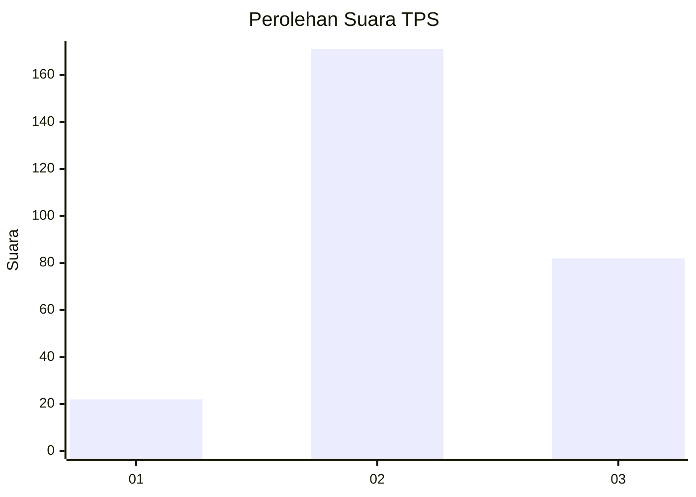
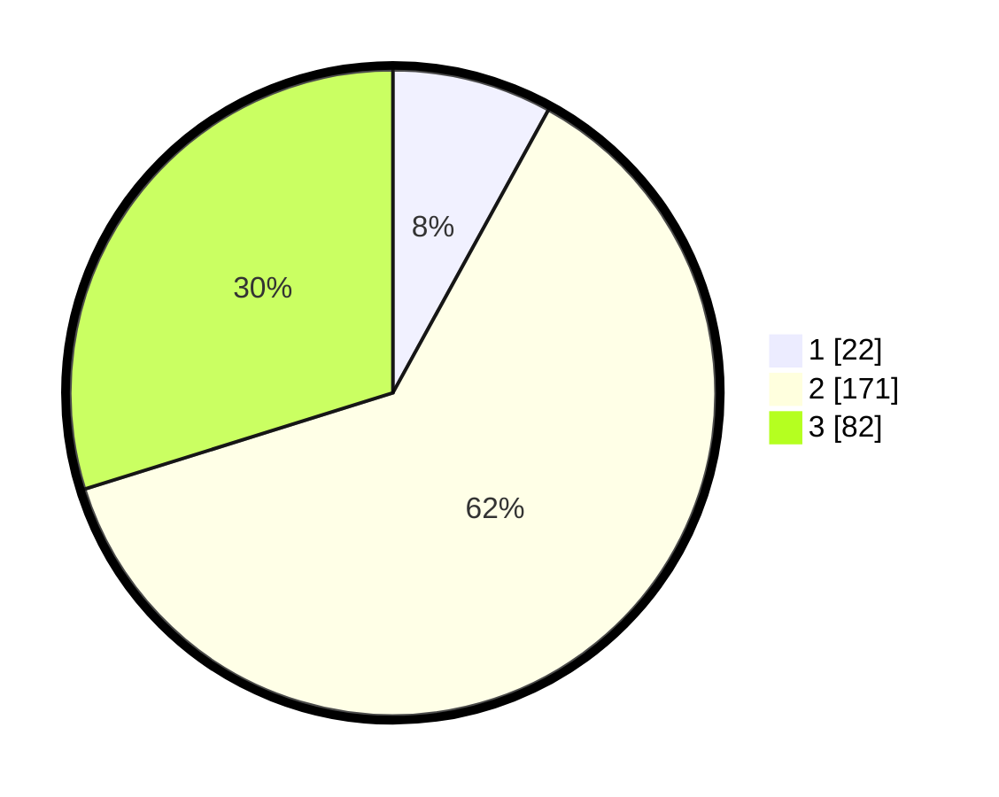

# Hasil

## Grafik

## Tabel

| No. | Nama Paslon    | Suara | Suara (raw) | Persentase |
|:--- |:-------------- | -----:| -----------:| ----------:|
| 1   | ANIES MUHAIMIN | 22    | [22][p-1]   | 8,00       |
| 2   | PRABOWO GIBRAN | 171   | [171][p-2]  | 62,18      |
| 3   | GANJAR MAHFUD  | 82    | [82][p-3]   | 29,82      |

[p-1]: https://github.com/gigit-pemilu/pemilu-2024-91-papua/blob/main/pilpres/hitung-suara/sub/91-papua/sub/71-kota-jayapura/sub/05-heram/sub/1004-yabansai/sub/012-tps/sub/paslon-1.txt
[p-2]: https://github.com/gigit-pemilu/pemilu-2024-91-papua/blob/main/pilpres/hitung-suara/sub/91-papua/sub/71-kota-jayapura/sub/05-heram/sub/1004-yabansai/sub/012-tps/sub/paslon-2.txt
[p-3]: https://github.com/gigit-pemilu/pemilu-2024-91-papua/blob/main/pilpres/hitung-suara/sub/91-papua/sub/71-kota-jayapura/sub/05-heram/sub/1004-yabansai/sub/012-tps/sub/paslon-3.txt

## Foto C Plano

https://sirekap-obj-formc.kpu.go.id/24bd/pemilu/ppwp/91/71/05/10/04/9171051004012-20240214-235941--ee4ddca9-54a9-4809-acb5-478fec0be4fd.jpg

https://sirekap-obj-formc.kpu.go.id/24bd/pemilu/ppwp/91/71/05/10/04/9171051004012-20240214-230842--3a663725-92ff-4116-a03b-f49853d3c0ca.jpg

https://sirekap-obj-formc.kpu.go.id/24bd/pemilu/ppwp/91/71/05/10/04/9171051004012-20240215-000057--fbe2be12-0845-4fb7-a770-0b4d63bf6707.jpg

## Metadata

| Key        | Value               |
| ---------- | ------------------- |
| Time Stamp | 2024-02-16 10:30:29 |

