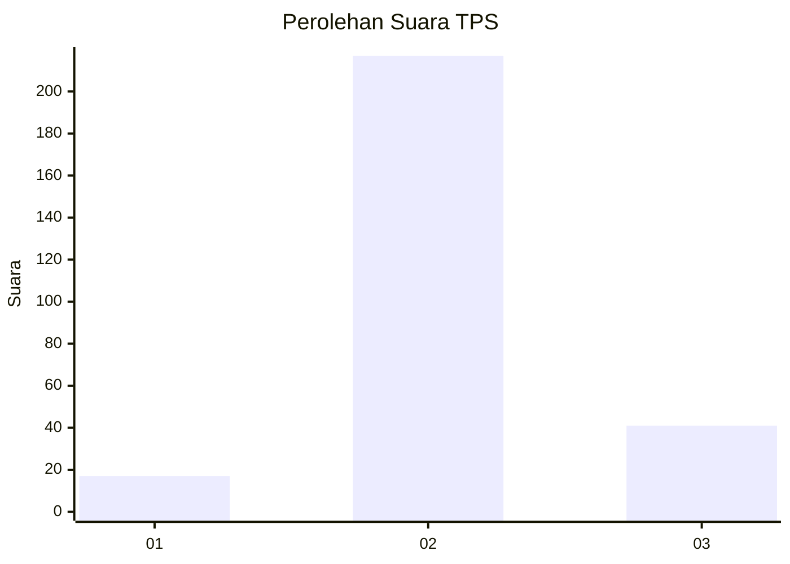

# Hasil

## Grafik

## Tabel

| No. | Nama Paslon    | Suara | Suara (raw) | Persentase |
|:--- |:-------------- | -----:| -----------:| ----------:|
| 1   | ANIES MUHAIMIN | 17    | [17][p-1]   | 6,18       |
| 2   | PRABOWO GIBRAN | 217   | [217][p-2]  | 78,91      |
| 3   | GANJAR MAHFUD  | 41    | [41][p-3]   | 14,91      |

[p-1]: https://github.com/gigit-pemilu/pemilu-2024-91-papua/blob/main/pilpres/hitung-suara/sub/91-papua/sub/71-kota-jayapura/sub/05-heram/sub/1004-yabansai/sub/015-tps/sub/paslon-1.txt
[p-2]: https://github.com/gigit-pemilu/pemilu-2024-91-papua/blob/main/pilpres/hitung-suara/sub/91-papua/sub/71-kota-jayapura/sub/05-heram/sub/1004-yabansai/sub/015-tps/sub/paslon-2.txt
[p-3]: https://github.com/gigit-pemilu/pemilu-2024-91-papua/blob/main/pilpres/hitung-suara/sub/91-papua/sub/71-kota-jayapura/sub/05-heram/sub/1004-yabansai/sub/015-tps/sub/paslon-3.txt

## Foto C Plano

https://sirekap-obj-formc.kpu.go.id/73d6/pemilu/ppwp/91/71/05/10/04/9171051004015-20240215-044510--0551b22c-6daa-4da1-a12c-aee7585aed58.jpg

https://sirekap-obj-formc.kpu.go.id/73d6/pemilu/ppwp/91/71/05/10/04/9171051004015-20240215-044531--f5e92c80-644b-47b6-8814-cb2138ebc121.jpg

https://sirekap-obj-formc.kpu.go.id/73d6/pemilu/ppwp/91/71/05/10/04/9171051004015-20240215-044550--5ca04139-6fe6-4dac-9247-61b5efbae0d2.jpg

## Metadata

| Key        | Value               |
| ---------- | ------------------- |
| Time Stamp | 2024-02-16 10:30:29 |

