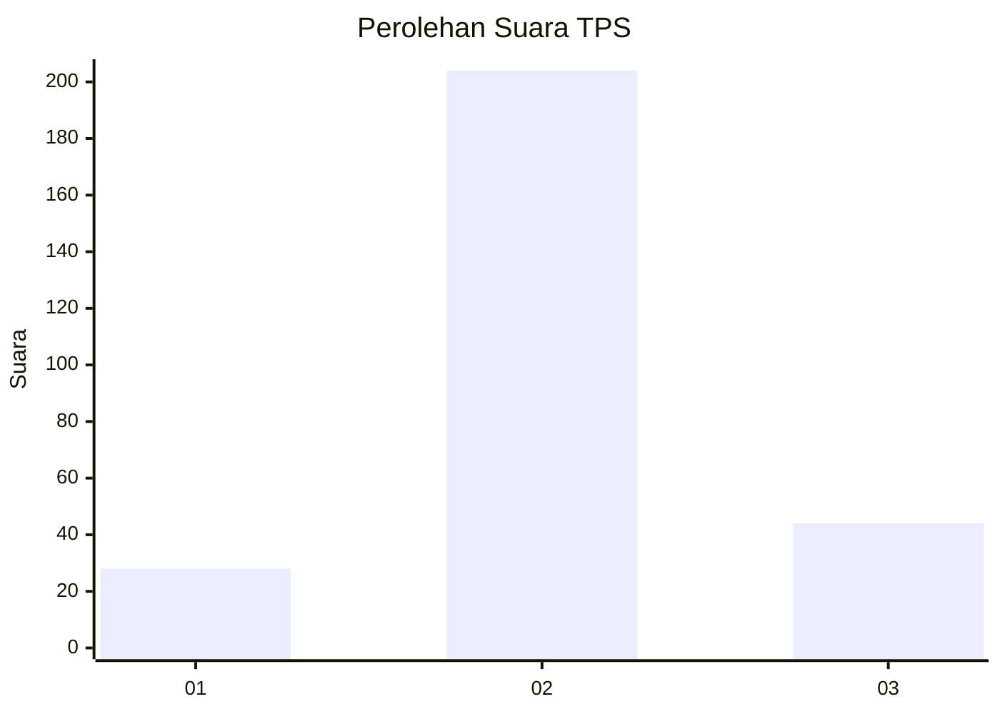
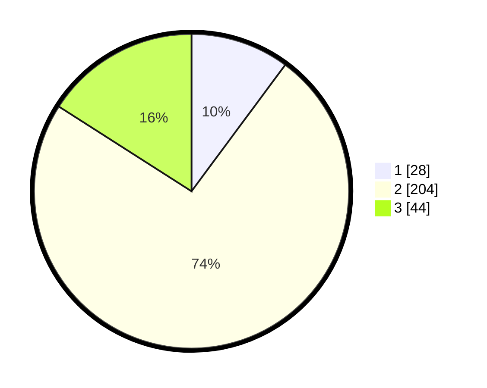

# Hasil

## Grafik

## Tabel

| No. | Nama Paslon    | Suara | Suara (raw) | Persentase |
|:--- |:-------------- | -----:| -----------:| ----------:|
| 1   | ANIES MUHAIMIN | 28    | [28][p-1]   | 10,14      |
| 2   | PRABOWO GIBRAN | 204   | [204][p-2]  | 73,91      |
| 3   | GANJAR MAHFUD  | 44    | [44][p-3]   | 15,94      |

[p-1]: https://github.com/gigit-pemilu/pemilu-2024-91-papua/blob/main/pilpres/hitung-suara/sub/91-papua/sub/71-kota-jayapura/sub/05-heram/sub/1004-yabansai/sub/016-tps/sub/paslon-1.txt
[p-2]: https://github.com/gigit-pemilu/pemilu-2024-91-papua/blob/main/pilpres/hitung-suara/sub/91-papua/sub/71-kota-jayapura/sub/05-heram/sub/1004-yabansai/sub/016-tps/sub/paslon-2.txt
[p-3]: https://github.com/gigit-pemilu/pemilu-2024-91-papua/blob/main/pilpres/hitung-suara/sub/91-papua/sub/71-kota-jayapura/sub/05-heram/sub/1004-yabansai/sub/016-tps/sub/paslon-3.txt

## Foto C Plano

https://sirekap-obj-formc.kpu.go.id/9ea4/pemilu/ppwp/91/71/05/10/04/9171051004016-20240215-022358--f186b133-17d7-4da5-9c24-52a2b4817c10.jpg

https://sirekap-obj-formc.kpu.go.id/9ea4/pemilu/ppwp/91/71/05/10/04/9171051004016-20240215-022424--782a3123-4d67-4aec-a4ab-4f6f66e96776.jpg

https://sirekap-obj-formc.kpu.go.id/9ea4/pemilu/ppwp/91/71/05/10/04/9171051004016-20240215-022441--ac46ae82-cad1-47f3-af60-be0308ef7d44.jpg

## Metadata

| Key        | Value               |
| ---------- | ------------------- |
| Time Stamp | 2024-02-26 13:00:00 |

