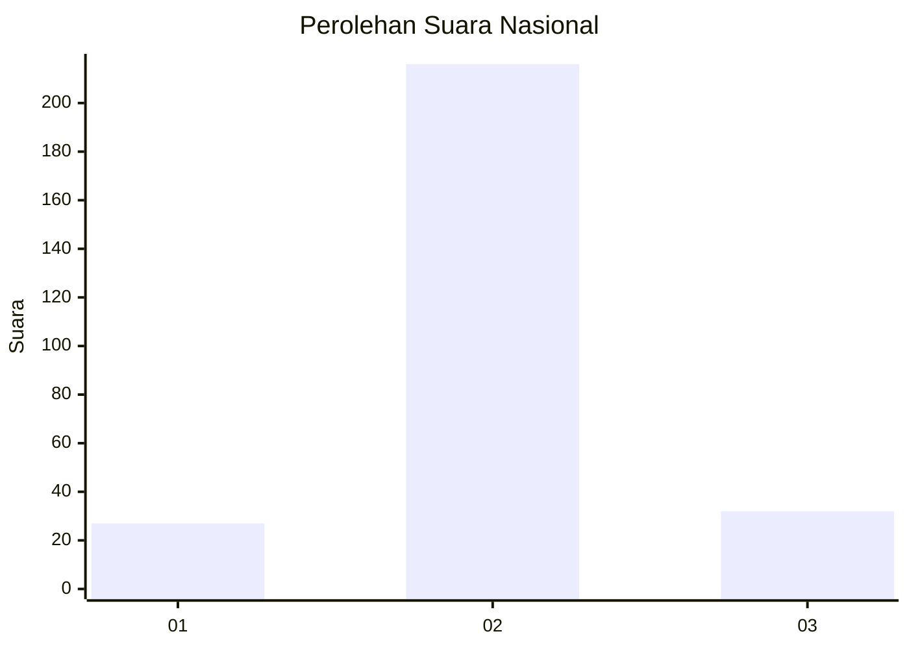
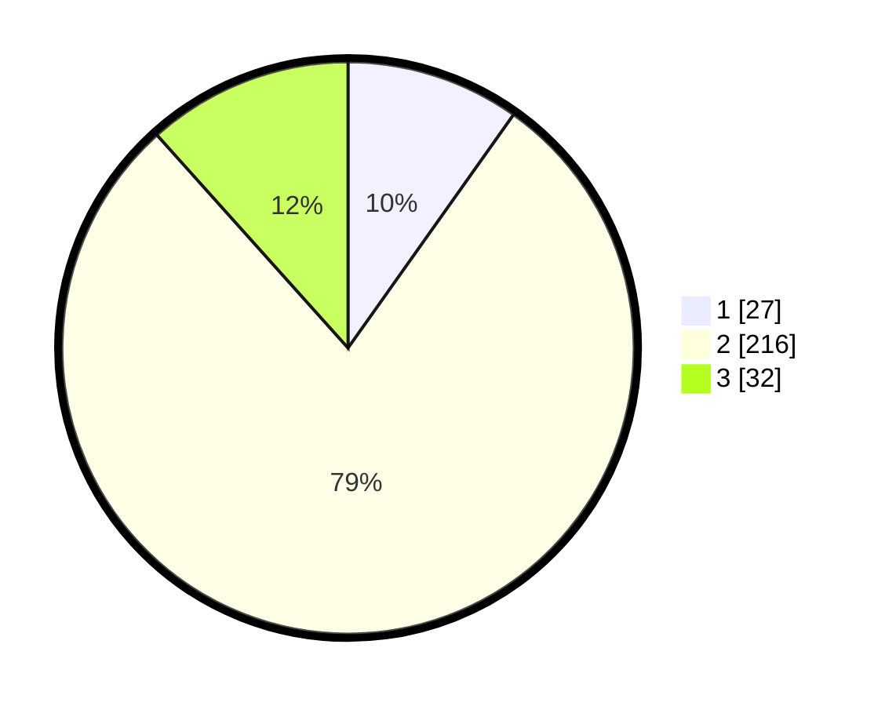

# Hasil

## Grafik

## Tabel

| No. | Nama Paslon    | Suara | Suara (raw) | Persentase |
|:--- |:-------------- | -----:| -----------:| ----------:|
| 1   | ANIES MUHAIMIN | 27    | [27][p-1]   | 9,82       |
| 2   | PRABOWO GIBRAN | 216   | [216][p-2]  | 78,55      |
| 3   | GANJAR MAHFUD  | 32    | [32][p-3]   | 11,64      |

[p-1]: https://github.com/gigit-pemilu/pemilu-2024/blob/main/pilpres/hitung-suara/sub/91-papua/sub/71-kota-jayapura/sub/05-heram/sub/1004-yabansai/sub/018-tps/sub/paslon-1.txt
[p-2]: https://github.com/gigit-pemilu/pemilu-2024/blob/main/pilpres/hitung-suara/sub/91-papua/sub/71-kota-jayapura/sub/05-heram/sub/1004-yabansai/sub/018-tps/sub/paslon-2.txt
[p-3]: https://github.com/gigit-pemilu/pemilu-2024/blob/main/pilpres/hitung-suara/sub/91-papua/sub/71-kota-jayapura/sub/05-heram/sub/1004-yabansai/sub/018-tps/sub/paslon-3.txt

## Foto C Plano

https://sirekap-obj-formc.kpu.go.id/3a10/pemilu/ppwp/91/71/05/10/04/9171051004018-20240215-004556--86fd4b52-8af2-40ee-a2de-4beec9a813e6.jpg

https://sirekap-obj-formc.kpu.go.id/3a10/pemilu/ppwp/91/71/05/10/04/9171051004018-20240215-004954--18caccd2-ed41-426d-a111-bfa26db4a740.jpg

https://sirekap-obj-formc.kpu.go.id/3a10/pemilu/ppwp/91/71/05/10/04/9171051004018-20240215-004751--646c7762-f185-4364-ad71-d0b6ed1e93d3.jpg

## Metadata

| Key        | Value               |
| ---------- | ------------------- |
| Time Stamp | 2024-02-24 22:31:28 |

