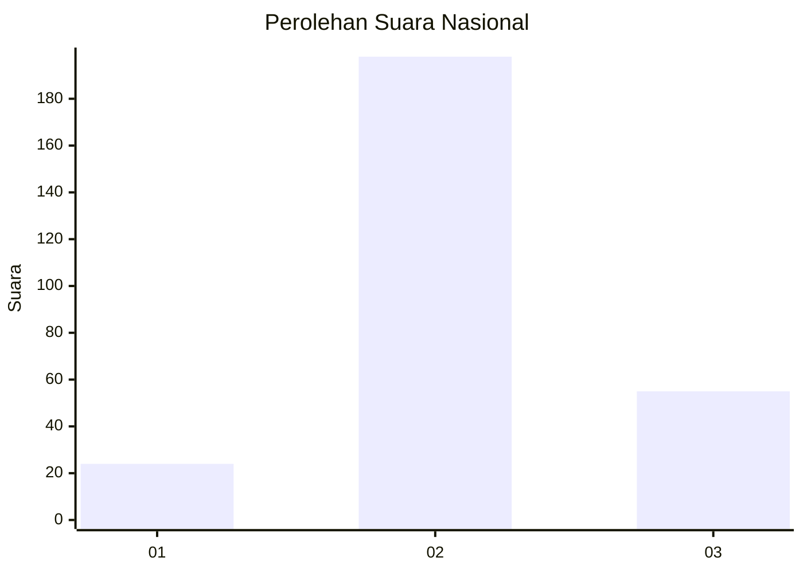
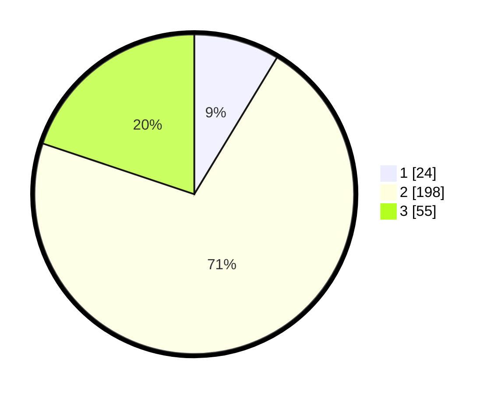

# Hasil

## Grafik

## Tabel

| No. | Nama Paslon    | Suara | Suara (raw) | Persentase |
|:--- |:-------------- | -----:| -----------:| ----------:|
| 1   | ANIES MUHAIMIN | 24    | [24][p-1]   | 8,66       |
| 2   | PRABOWO GIBRAN | 198   | [198][p-2]  | 71,48      |
| 3   | GANJAR MAHFUD  | 55    | [55][p-3]   | 19,86      |

[p-1]: https://github.com/gigit-pemilu/pemilu-2024/blob/main/pilpres/hitung-suara/sub/91-papua/sub/71-kota-jayapura/sub/05-heram/sub/2003-yoka/sub/002-tps/sub/paslon-1.txt
[p-2]: https://github.com/gigit-pemilu/pemilu-2024/blob/main/pilpres/hitung-suara/sub/91-papua/sub/71-kota-jayapura/sub/05-heram/sub/2003-yoka/sub/002-tps/sub/paslon-2.txt
[p-3]: https://github.com/gigit-pemilu/pemilu-2024/blob/main/pilpres/hitung-suara/sub/91-papua/sub/71-kota-jayapura/sub/05-heram/sub/2003-yoka/sub/002-tps/sub/paslon-3.txt

## Foto C Plano

https://sirekap-obj-formc.kpu.go.id/5982/pemilu/ppwp/91/71/05/20/03/9171052003002-20240214-232730--87c9c003-0c93-4244-9d01-fe5c1c5aab85.jpg

https://sirekap-obj-formc.kpu.go.id/5982/pemilu/ppwp/91/71/05/20/03/9171052003002-20240214-232857--990fd6f2-778e-4674-8d9f-10c1862b2dea.jpg

https://sirekap-obj-formc.kpu.go.id/5982/pemilu/ppwp/91/71/05/20/03/9171052003002-20240214-233008--48e0fd3b-43eb-4f4e-b1b9-d1a0f6ac3e25.jpg

## Metadata

| Key        | Value               |
| ---------- | ------------------- |
| Time Stamp | 2024-02-25 21:00:00 |

