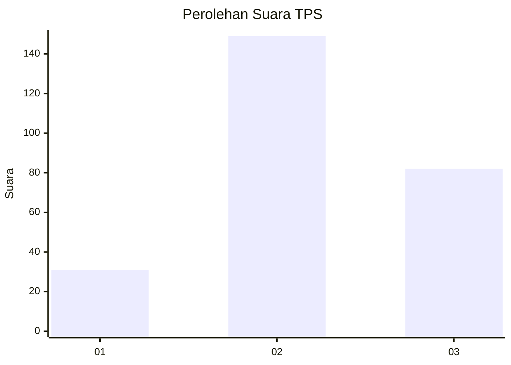
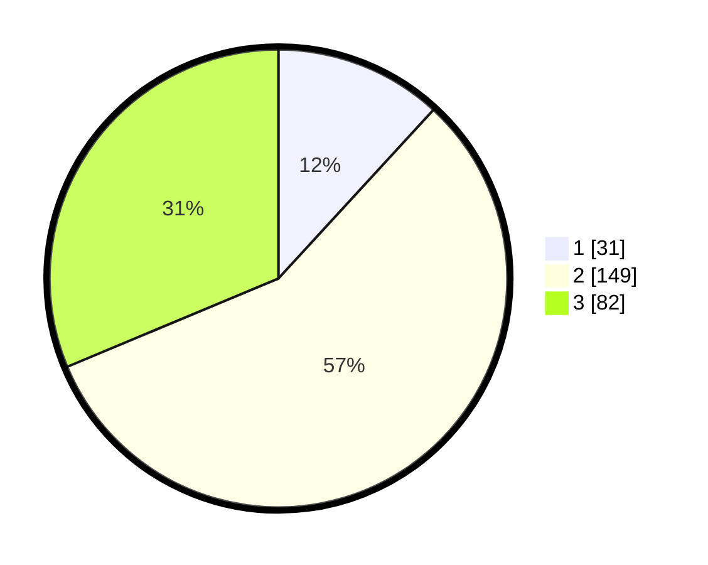

# Hasil

## Grafik

## Tabel

| No. | Nama Paslon    | Suara | Suara (raw) | Persentase |
|:--- |:-------------- | -----:| -----------:| ----------:|
| 1   | ANIES MUHAIMIN | 31    | [31][p-1]   | 11,83      |
| 2   | PRABOWO GIBRAN | 149   | [149][p-2]  | 56,87      |
| 3   | GANJAR MAHFUD  | 82    | [82][p-3]   | 31,30      |

[p-1]: https://github.com/gigit-pemilu/pemilu-2024-91-papua/blob/main/pilpres/hitung-suara/sub/91-papua/sub/71-kota-jayapura/sub/05-heram/sub/2005-waena/sub/002-tps/sub/paslon-1.txt
[p-2]: https://github.com/gigit-pemilu/pemilu-2024-91-papua/blob/main/pilpres/hitung-suara/sub/91-papua/sub/71-kota-jayapura/sub/05-heram/sub/2005-waena/sub/002-tps/sub/paslon-2.txt
[p-3]: https://github.com/gigit-pemilu/pemilu-2024-91-papua/blob/main/pilpres/hitung-suara/sub/91-papua/sub/71-kota-jayapura/sub/05-heram/sub/2005-waena/sub/002-tps/sub/paslon-3.txt

## Foto C Plano

https://sirekap-obj-formc.kpu.go.id/9aeb/pemilu/ppwp/91/71/05/20/05/9171052005002-20240214-213647--7d105d96-b9fa-4ce2-82c6-2d4c016117b6.jpg

https://sirekap-obj-formc.kpu.go.id/9aeb/pemilu/ppwp/91/71/05/20/05/9171052005002-20240214-214323--5dbca0a7-cbe3-4951-ae7c-752490986dbf.jpg

## Metadata

| Key        | Value               |
| ---------- | ------------------- |
| Time Stamp | 2024-02-22 12:00:00 |

